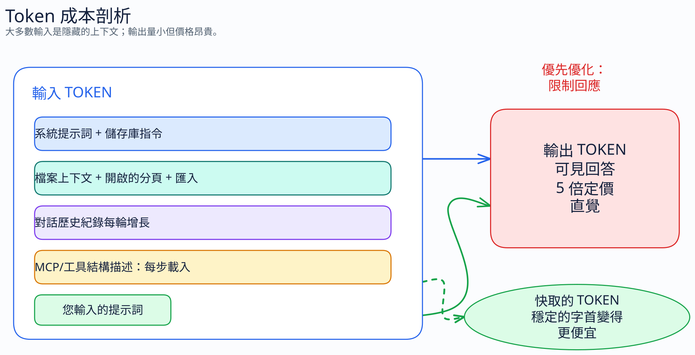
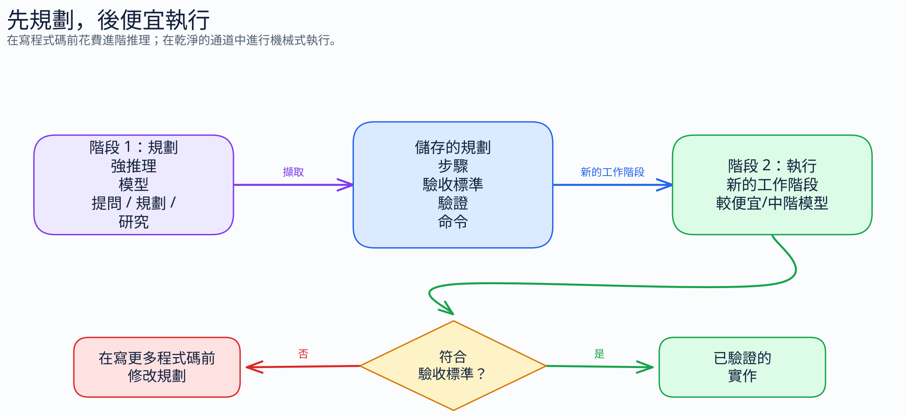

# GitHub Copilot Token 優化指南

> [!IMPORTANT]
> **這不是 GitHub 或 Microsoft 的官方指南。** 本指南是由實際現場經驗產生的社群資源 — 從開發用途採用 AI 的從業者所觀察到的模式、測試過的技術以及學到的教訓。它反映了產業的回饋：由下而上收集的實用知識，而不是由上而下的產品文件。請使用它來了解優化策略，並根據客戶的情境調整適用的內容。官方指南位於 [docs.github.com/copilot](https://docs.github.com/copilot)。

> 一份實用的、資料驅動的指南，旨在減少 Token 消耗，同時保持程式碼品質。
> 涵蓋 Chat、Inline 和 Coding Agent 工作流程。

---

## 快速入門 — 現在可以做的 14 件事

> **2026 年 6 月 1 日 — 用量計費 (Usage-Based Billing, UBB) 已上線。** GitHub Copilot 現在根據實際 Token（輸入 + 輸出 + 快取）計費，這些 Token 從匯集的 AI 額度（Business 方案每席位 30 美元，Enterprise 方案每席位 70 美元）中提取，而不是根據請求次數計費。本指南中的每項技術都直接轉化為額度節省 — 而且對快取友善的習慣比以往任何時候都更重要。有關客戶護欄，請參閱 [企業治理 (Enterprise Governance)](docs/12-enterprise-governance.md)，有關模型成本指導，請參閱 [模型選擇與定價 (Model Selection & Pricing)](docs/11-models-and-pricing.md)。

> **輸出 Token 的成本遠高於輸入 Token。** 這是本指南中最重要的定價事實。Anthropic 的公開定價使這種不對稱性變得具體（每百萬 Token 輸入/輸出：Haiku 1 美元/5 美元，Sonnet 3 美元/15 美元，Opus 5 美元/25 美元）。Copilot 確切的每模型 UBB 定價表尚未公開，但 UBB 仍然使冗長的輸出成本成倍增加。大多數輸入 Token 來自檔案內容、歷史紀錄和工具結構定義 (schemas) — 而不是來自你輸入的內容。你輸入的提示詞僅佔總輸入的一小部分。從輸出控制開始，然後解決結構性輸入的獲益。

沒有時間閱讀完整指南？今天就執行這些操作以削減你的 Token 使用量：

| # | 行動 | 主要效果 | 設定時間 |
|---|--------|----------------|----------------|
| 1 | **請求僅程式碼的回應** — 在 `copilot-instructions.md` 中加入 `Code only, no explanation.`。最高每 Token 投資報酬率 (ROI)：輸出成本是輸入的 5 倍，且這能永久減少每個程式碼任務 40-70% 的輸出 | 縮減回應長度 | 0 分鐘 |
| 2 | **預設限制輸出格式** — 在 `copilot-instructions.md` 中加入 `Bullets over paragraphs. No explanations unless asked.` | 保持回答簡潔 | 0 分鐘 |
| 3 | **縮減始終開啟的上下文 (Always-on context)** — 壓縮 `copilot-instructions.md` 並僅保留 `AGENTS.md` 中的關鍵內容。這兩個檔案中的每個 Token 都會在每次互動（以及每個 Agent 步驟）中計費。去除贅字，刪除 Agent 可透過讀取程式碼發現的任何內容，刪除 LLM 生成的 `/init` 樣板 | 減少始終開啟的輸入/上下文 | 15 分鐘 |
| 4 | **預設使用 Auto 模型選擇 + 保護快取穩定性** — 以 Auto 為基準，因為它會從支援的 Auto 池中選擇，並提供付費方案的折扣。在昂貴且漫長的對話中，保持 `{ 模型, 啟用的 MCP 集合, 啟用的代理程式/設定檔 }` 穩定。如果必須切換，請開啟新的對話並附上簡短的交接摘要。請參閱 [模型選擇與定價](docs/11-models-and-pricing.md) | 降低合格用量的計費率，並保留快取輸入的折扣 | 0 分鐘 |
| 5 | **針對簡單問題使用提問模式 (Ask Mode)** — 保留 Agent 模式用於多步驟任務 | 避免 Agent 開銷 | 0 分鐘 (只需選擇正確的模式) |
| 6 | **使用 `applyTo:` 路徑範圍限制上下文** — 將一個大型指令檔案分割成多個小的範圍指令檔案，僅在相關時載入 | 減少始終開啟的輸入/上下文 | 15 分鐘 |
| 7 | **在提示詞中保持精確** — 使用 "Add null check to `getUser()`"，而不是 "Can you please look at this and maybe add some error handling?" 注意：你輸入的提示詞僅佔總輸入的一小部分；精確度對於品質的影響大於對原始 Token 節省的影響 | 提高任務針對性 | 0 分鐘 |
| 8 | **根據目標模型重新調整提示詞** — 提供者的提示引導會根據模型/版本而變化。將官方指南 URL 貼入 Copilot，並要求它為你實際使用的模型調整 `.github/copilot-instructions.md`、Agent 個人檔案或應用程式提示 | 減少重做 | 每個模型變更 10 分鐘 |
| 9 | **審核您的 MCP 伺服器和注入工具** — 停用未使用的 MCP 伺服器和新增技能/工具的 VS Code 擴充功能；使用乾淨的程式碼設定檔或針對重複工作流程的自訂代理程式。每個 MCP 工具每次代理步驟大約消耗 100-500 個 Token。如果之後 shell 輸出仍然很大，請評估一個輸出過濾器，例如 [RTK](https://github.com/rtk-ai/rtk) 或 [`snip`](https://github.com/edouard-claude/snip) | 移除工具/模式開銷和冗餘命令輸出 | 5-10 分鐘 |
| 10 | **在 AI 工作前將豐富檔案轉換為 Markdown** — `.docx`、`.pdf`、`.pptx`、`.xlsx`、HTML、圖片、音訊、影片和 ZIP 檔案帶有格式稅。[Marc Bara 的文章](https://medium.com/@marc.bara.iniesta/your-docx-is-wasting-33-of-your-ai-budget-86a3d229d042)顯示了成本；在聊天、Agent 或 RAG 攝取之前使用 [Microsoft MarkItDown](https://github.com/microsoft/markitdown) | 減少雜亂的輸入上下文 | 5 分鐘 |
| 11 | **每週執行 `/chronicle cost tips` 與 `/chronicle improve`** (**僅限 Copilot CLI**，實驗性) — 這些斜線指令在互動式 Copilot CLI 工作階段（而非 VS Code）中運作，不是一般的 Copilot Chat 功能。`cost tips` 分析你的 Token 支出並建議減少方式；`improve` 尋找 CLI 工作階段歷史紀錄中反覆出現的混淆，並產生自訂指令修正，讓同樣的誤解意圖不再永久消耗 Token | 減少重複重做與直接 Token 支出 | 每次執行 2 分鐘 |
| 12 | **針對長工具鏈嘗試 CodeAct** (**僅限 Copilot CLI**，選用外部外掛程式) — [`copilot-codeact-plugin`](https://github.com/jsturtevant/copilot-codeact-plugin) 將多步驟工具鏈摺疊成一個沙盒執行，這可以減少系統提示詞、先前訊息和工具定義的重複重播 | 減少工具迴圈重播 | 10-15 分鐘 |
| 13 | **先規劃，然後在新會話中執行** — 使用計劃模式（CLI）或詢問模式（VS Code）與強模型協商方案，將計劃保存到 `plan.md` 或問題中，然後在乾淨的會話中執行該計劃，通常使用更高效的模型。一次獲得正確結果可以避免代理程式碼方向錯誤而導致的昂貴返工。請參閱[先計劃，後執行 §2.5.9](docs/06-workflow-optimization.md#259-plan-first-then-execute-and-route-the-phases) 和[每個 Token 的結果](docs/13-outcome-per-token.md) 分鐘 |
| 14 | **使用 Graphify 建立持久化程式碼庫圖**（可選，VS Code + Copilot CLI）— [`graphify`](https://github.com/Graphify-Labs/graphify) 使用 tree-sitter AST 對程式碼庫進行一次映射，並將結果寫入 `graphify-out/graph.json`；最適合大型程式碼庫，因為在這些程式碼庫中，方向讀取是代理程式輸入的主要部分。安裝：`uv tool install graphifyy` | 減少重複的檔案讀取輸入 | 5-10 分鐘 |

**是從企業或客戶治理的角度而不是個人設定的角度來看待這件事嗎？** 請參閱 [企業治理 (Enterprise Governance)](docs/12-enterprise-governance.md)。該章節涵蓋了 AI 額度預算、每使用者緊縮、模型存取政策、組織指令以及獨立組織權衡。

*上述數值僅針對各列中所述的機制，不可累加，也不代表總帳單減少量。*

輸出控制（#1、#2）立竿見影且效果顯著－只需設定一次，即可在每次呼叫中生效。結構化輸入控制（#3、#6）在每次交互作用中都能產生累積效應。模型路由（#4、#5）降低了計費層的成本。模型特定的提示調整（#8）透過提高首次處理品質來減少浪費。 MCP 審計（#9）消除了每個代理任務中數千個隱藏的標記；RTK/snip 式輸出過濾器解決了冗長 shell 結果帶來的額外成本。 Markdown 轉換（#10）在模型接觸到 DOCX/PDF/HTML 佈局之前就將其移除。基於圖表的導航（#14）預先載入一次程式碼庫方向，然後在代理會話中重複使用。

---

## 指南內容

### 第 1 部分：為什麼 Token 很重要

了解 BPE Token 化、為什麼 Token 對成本/速度/限制很重要，以及 GitHub Copilot 如何在幕後使用 Token。

→ **[閱讀第 1 部分](docs/01-why-tokens-matter.md)**

---

### 第 2 部分：技術

#### [2.1 提示詞壓縮 (Prompt Compression)](docs/02-prompt-compression.md)

原始人語 (Caveman-speak)、強度級別 (精簡/完整/極限)、結構化格式、縮寫以及以程式碼為中心的提示。可節省 30-50% 的輸入 Token；結合輸出控制 (2.4) 可節省輸出 Token。

#### [2.2 語言比較 (Language Comparison)](docs/03-language-comparison.md)

資料支持的比較：在這些範例中，英文是 Token 效率最高的語言。CJK (中日韓) 語言的成本高出 1.7-2.4 倍。包含 8 種語言的 Token 化表格。

#### [2.3 上下文管理 (Context Management)](docs/04-context-management.md)

壓縮系統指令、壓縮記憶體檔案、使用 `applyTo` 限制上下文範圍、關閉未使用的編輯器分頁、在 AI 工作前將非文字檔案轉換為 Markdown、設定內容排除 (Content Exclusion，適用於 Business/Enterprise 管理員)、開啟新對話。控制發送給模型的內容。

#### [2.4 輸出控制 (Output Control)](docs/05-output-control.md)

"Code only, no explanation." 限制回應格式。將簡潔的輸出設定為專案預設值。

#### [2.5 工作流程優化 (Workflow Optimization)](docs/06-workflow-optimization.md)

簡潔的提交訊息 (commit messages)、單行 PR 審閱、提問 (Ask) 與 Agent 模式選擇、特定模型的提示調校，以及何時「不要」壓縮。

#### [2.6 始終開啟的上下文問題 (The Always-On Context Problem)](docs/07-agents-md-problem.md)

對 LLM 生成的上下文檔案的研究顯示，它們通常會損害 Agent 的正確性，同時增加 Token 成本。同樣的教訓也適用於 `AGENTS.md` 和 `.github/copilot-instructions.md` — 它們是不同的慣例（不同的檔名、不同的歷史擁有者），但目前在 Copilot 中都作為始終開啟的上下文運作。對你的儲存庫所使用的檔案套用「僅保留關鍵內容 (landmines only)」的方法。將上下文檔案視為錯誤追蹤器 (bug tracker)，而不是維基 (wiki)。

#### [2.7 MCP 與工具成本 (MCP & Tool Costs)](docs/08-mcp-tool-costs.md)

隱藏的 Token 稅：每個 MCP 工具在每個 Agent 步驟中成本為 100-500 Token。15 台伺服器 × 15 個步驟 = 26.5 萬 Token 的開銷。這涵蓋了 MCP 審計、Copilot 框架基線、RTK、snip、最小上下文工具以及相關的輸出/上下文壓縮工具。

---

### 第 3 部分：比較與資料

對比提示詞比較、語言 Token 化表格、完整的技術矩陣（40 多種技術），以及帶有收益遞減曲線的品質影響評估。

→ **[閱讀第 3 部分](docs/09-comparisons-data.md)**

---

### 第 4 部分：實作設定

循序漸進：設定 Copilot、優化 Coding Agent、設定 Agent 模式並養成習慣。包含 VS Code 設定、決策框架和為期 4 週的採用計畫。

→ **[閱讀第 4 部分](docs/10-practical-setup.md)**

---

### 第 4.2 部分：模型選擇與定價

專門介紹模型的頁面、PRU 時代的倍數歷史、目前的 Auto 導向、方案可用性，以及當 Copilot 確切的每模型 UBB 表格尚未發布時，供應商輸入/輸出 Token 定價的適用之處。包含指向 GitHub 官方文件的連結，涵蓋自動模型選擇、計費以及方案/模型可用性。

→ **[閱讀第 4.2 部分](docs/11-models-and-pricing.md)**

---

### 第 4.3 部分：企業治理

專為面向客戶的管理員指南設計的章節：使用量計費護欄、AI 額度預算、支出群組、FinOps 即程式碼自動化、模型存取政策、組織級指令，以及獨立組織的權衡。

→ **[閱讀第 4.3 部分](docs/12-enterprise-governance.md)**

---

### 第 4.4 部分：每個 Token 的結果

專門介紹從最小化 Token 到每個 Token 的價值的轉變：先制定計劃再執行、提示技能進階、模型路由、基準注意事項，以及在使用量計費下的日常模型選擇。

→ **[閱讀第 4.4 部分](docs/13-outcome-per-token.md)**

---

需要術語表、快速術語、工具或核心外部連結嗎？請前往 [指南首頁](docs/index.md)。

---

## 最高影響力的技術

按成本影響排序。輸出優先 — 每 Token 成本是輸入的 5 倍。

1. **輸出控制** — "Code only, no explanation" + 在 `copilot-instructions.md` 中設定簡潔預設值。程式碼任務可節省 40-70% 的輸出，所有互動中平均節省 30-60%。一次指令，永久生效。
2. **縮減始終開啟的上下文** (`copilot-instructions.md` + `AGENTS.md`) — 壓縮贅字，僅保留關鍵內容，刪除 LLM 生成的樣板。在每次互動和 Agent 步驟中產生複利效果；減少 20-23% 的 Agent 任務開銷並提高正確性。
3. **針對簡單問題使用提問模式 (Ask Mode)** — 透過避免 Agent 開銷可節省 60-90%。
4. **稽核 MCP 伺服器與注入的工具** — 停用未使用的伺服器/擴充功能，或使用純淨的程式碼設定檔/自訂 Agent，以在每個 Agent 任務中節省 5K-190K Token
5. **自動模型選擇** — 預設導向較低成本的模型，並在合格用量上提供付費方案折扣，無需額外努力。
6. **先將豐富檔案轉換為 Markdown** — 避免在聊天、Agent 和 RAG 工作流程中為 Word/PDF/HTML 的版面配置雜訊付費。
7. **建立持久程式碼庫圖譜** — 在大型儲存庫中使用 Graphify，讓代理程式查詢 `graph.json`，而非每次工作階段都重新讀取結構檔案
8. **根據目標模型調整提示詞** — 提升首次輸出品質，減少重複澄清輪次
9. **精確提示詞** — 佔使用者提示詞輸入 Token 的 20-40%；對品質的影響大於原始 Token 節省

---

*這是一份動態文件。隨著 Token 化技術的演進、模型能力的改變以及新技術的出現，本指南將會持續更新。請查看儲存庫以獲取最新版本。*
