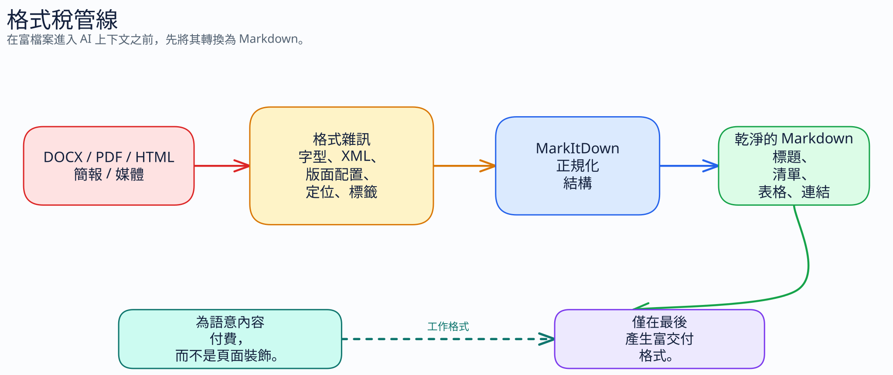
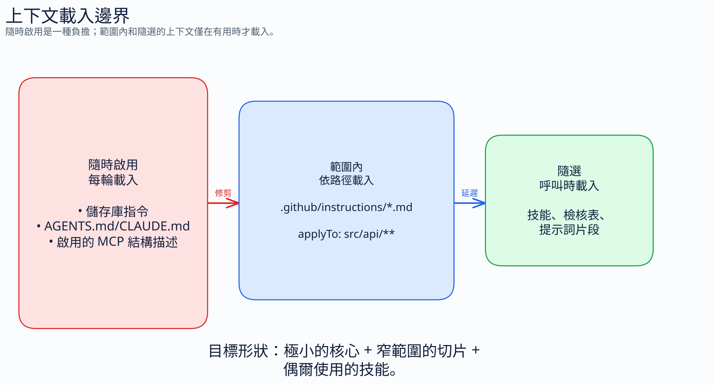
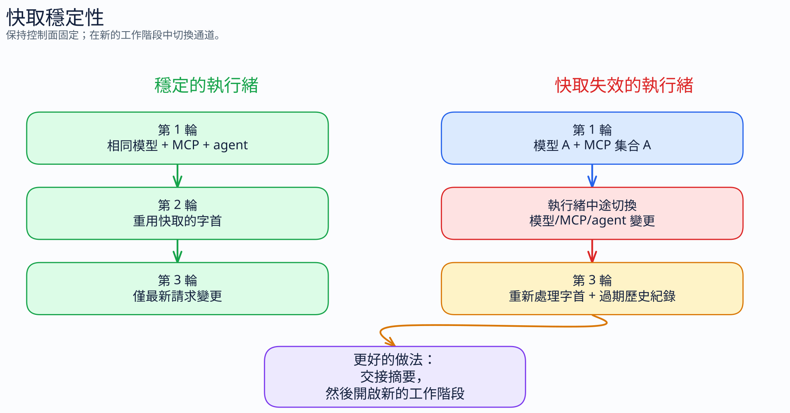
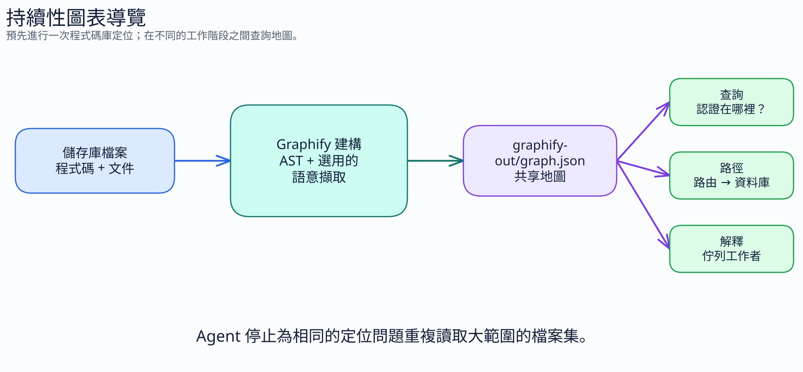

# 2.3 上下文管理 —— 控制發送的內容

[← 返回指南](index.md)

---

## 2.3.1 系統指令壓縮

你的 `.github/copilot-instructions.md` 文件會被注入到**每一次 Copilot 互動**中。其中的每個字都會在每次提示時消耗 Token。

> **注意 —— 相關但不同的約定。** `.github/copilot-instructions.md` 是 GitHub Copilot 原生的存儲庫級指令文件。`AGENTS.md` 是一個更廣泛的跨工具約定，Copilot 也會讀取它。它們**不是同一個文件**，並且可以合法地共存（例如 `AGENTS.md` 由多個 AI 工具共享，`copilot-instructions.md` 用於 Copilot 特定規則）。它們的共同點在於，兩者都充當**始終開啟的上下文** —— 兩個文件中的每個 Token 都會在每次互動中支付費用。本節中的壓縮和修剪技術同樣適用於兩者。如果你的存儲庫在兩個文件中包含重複內容，那麼該重複內容將被支付兩次費用；請無情地去重。請參閱 [第 2.6 部分](07-agents-md-problem.md) 以了解*要保留什麼*的研究。

這使得該文件成為優化槓桿最高的文件。一個約 500 字、約 700 個 Token 的指令文件，意味著在每次互動中都會消耗 700 個 Token —— 甚至在你輸入問題之前。

**之前 —— 自然英文 (~30 個 Token)：**

```text
You should write terse responses like a caveman. Make sure all technical substance
remains exact. Only remove unnecessary filler words. Drop articles and hedging.
Use fragments when appropriate. Keep code unchanged. Use short synonyms where possible.
```

**之後 —— 壓縮後 (~12 個 Token)：**

```text
Terse like caveman. Technical substance exact. Only fluff die.
Drop: articles, filler (just/really/basically), pleasantries, hedging.
Fragments OK. Short synonyms. Code unchanged.
```

**節省：60%。** 在一個會話中與每次互動相乘。超過 50 次互動，僅從這一個文件中就能節省 900 個 Token。

**真實案例：** 此存儲庫自己的 `.github/copilot-instructions.md` 已經過壓縮：

```text
Terse like caveman. Technical substance exact. Only fluff die.
Drop: articles, filler (just/really/basically), pleasantries, hedging.
Fragments OK. Short synonyms. Code unchanged.
Pattern: [thing] [action] [reason]. [next step].
ACTIVE EVERY RESPONSE. No revert after many turns. No filler drift.
Code/commits/PRs: normal. Off: "stop caveman" / "normal mode".
```

約 50 個 Token。在每次互動時加載。這就是優化後的指令文件的樣子。

## 2.3.2 記憶文件壓縮

除了 `copilot-instructions.md` / `AGENTS.md`（兩種不同的慣例，均可被載入；見上方註解）之外，許多專案還會累積其他會成為上下文的記憶檔案：`CLAUDE.md`、專案筆記、編碼規範、`.cursorrules`。這些都會被載入為上下文，且在每次呼叫時都會消耗 Token。在開始壓縮之前，請先合併重複的內容。

**之前 (~40 個 Token)：**

```text
You should always make sure to run the test suite before pushing any changes
to the main branch. This is important because it helps catch bugs early and
prevents broken builds from being deployed to production.
```

**之後 (~15 個 Token)：**

```text
Run tests before push to main. Catch bugs early, prevent broken prod deploys.
```

**節省：62%。** 技術含義完全相同。

**壓縮規則：**

- 移除冠詞、填充詞、模糊措辭、客套話
- 使用短同義詞和碎片化語句
- **保留所有：** 代碼塊、內聯代碼、URL、文件路徑、技術術語
- 保持 Markdown 結構（標題、列表、表格）

本存儲庫不再附帶可安裝的工作流包。當記憶文件變成始終開啟的上下文時，請手動壓縮它們，或者在提示詞之外保留偶爾使用的壓縮檢查清單，並僅在需要時調用它們。

## 2.3.3 戰略性文件組織

Copilot 會自動包含來自你工作區的上下文 —— 開啟的文件、導入的模組、附近的文件。你可以控制包含的內容。

**官方的排除機制是內容排除 (Content Exclusion)**，由存儲庫 / 組織 / 企業管理員通過 GitHub 設置或 REST API 進行配置。它僅在 **Copilot Business 和 Enterprise** 上可用，並且**不適用於** Copilot CLI、Copilot 雲端代理或 IDE 中 Copilot Chat 的代理模式。請將其視為隱私 / 策略控制（"不要閱讀此文件"），而不是每個開發者用來節省 Token 的旋鈕。請參閱 [GitHub 文檔 —— 從 GitHub Copilot 中排除內容](https://docs.github.com/en/copilot/how-tos/configure-content-exclusion/exclude-content-from-copilot)。

真正減少自動包含上下文的方法（適用於任何地方的開發者槓桿）：

- **關閉你不在處理的文件。** 開啟的編輯器分頁是自動包含上下文的最大來源。關閉一個你沒有觸碰的 1,000 行文件是 IDE Copilot 中最快的 Token 獲勝方式。
- **保持文件集中且短小。** 如果一個 1,000 行的文件是開啟的，Copilot 可能會將其大部分內容作為上下文發送。將大型文件分解為集中的模組。
- **對構建輸出、依賴目錄 (vendor dirs) 和生成的文件使用 `.gitignore`。** Git 忽略的任何內容通常都不會被提取為自動上下文，這在副作用上也能保持存儲庫整潔。
- **使用 `applyTo:` 有範圍限制的指令文件**（見下文 § 2.3.4），以便特定領域的上下文僅在相關文件開啟時加載 —— 這是縮小單次互動上下文最可靠的方法。
- **對於 Business/Enterprise 客戶：** 請求你的存儲庫 / 組織管理員為真正敏感的路徑（秘密資訊、生成的軟體包、大型數據文件）配置**內容排除**。主要目的是政策，但它也能讓這些內容遠離 Chat / 補全。

**請留意** —— 以下列表中的任何內容，如果開啟或被引用，都會消耗 Token：

- 大型 README 文件
- 生成的文件（構建輸出、打包的 CSS、精簡後的 JS）
- 依賴目錄 (Vendor directories)
- 數據文件（CSV、JSON 測試固定數據）
- 存檔的文檔
- 豐富的文檔格式（`.docx`、`.pdf`、`.pptx`、`.xlsx`、HTML 導出、掃描圖像、音頻/視頻轉錄）

進入上下文的每個文件都會消耗 Token。請有意識地決定哪些文件是開啟的，以及哪些文件是用 `#file` 引用的。

### 先將非文本輸入規範化為 Markdown

當來源是 Word 文件、PDF、PowerPoint、電子表格、圖像、音頻文件或導出的 HTML 時，如果可以避免，請不要將豐富格式直接粘貼到 AI 工作流中。先將其轉換為乾淨的 Markdown，然後發送 Markdown。



Marc Bara 在 [《你的 .docx 浪費了你 33% 的 AI 預算》](https://medium.com/@marc.bara.iniesta/your-docx-is-wasting-33-of-your-ai-budget-86a3d229d042) 中稱之為**格式稅 (format tax)**：Word、PDF 和 HTML 攜帶字體數據、XML、頁面定位元數據、佈局偽影、嵌入對象和標籤湯，模型必須處理這些內容，但很少需要它們。該文章引用了一個具體範例，從 PDF 中提取的 10 頁報告使用了大約 12,400 個 Token，而同樣內容作為乾淨的 Markdown 僅使用了大約 8,350 個 Token —— 在資訊相同的情況下減少了 33%。HTML 導出可能更糟，因為語義內容被包裹在長標籤、類名、ID 和佈局支架中。

規則：將 Markdown 作為 AI 互動的**工作格式**，並將 Word/PDF/PowerPoint 視為交付格式。在 Markdown 中進行草擬、審查、總結、分塊和檢索。僅在客戶、監管機構或內部流程需要該產出物時，才在最後生成 `.docx` 或 `.pdf`。

[Microsoft MarkItDown](https://github.com/microsoft/markitdown) 是實用的橋樑。它是一個 Python 工具，用於將文件和 Office 文檔轉換為 Markdown，供 LLM 和文本分析管道使用。它保留了有用的結構，如標題、列表、表格、鏈接和提取的元數據，同時避免了高保真的視覺佈局噪音。目前的轉換器包括 PDF、Word、PowerPoint、Excel、具有 EXIF/OCR 支持的圖像、具有轉錄支持的音頻、HTML、CSV/JSON/XML、ZIP 內容、YouTube URL、EPUB 等。

快速路徑：

```bash
pip install 'markitdown[all]'
markitdown report.docx -o report.md
markitdown deck.pptx -o deck.md
markitdown source.pdf > source.md
```

當你控制工作流並希望減少依賴項時，請使用更窄的 extras：

```bash
pip install 'markitdown[pdf,docx,pptx,xlsx]'
```

安全說明：MarkItDown 以當前進程的權限閱讀文件、串流和 URL。對於不可信的輸入，請先驗證路徑和 URL，並首選適合該工作流的最窄轉換 API。

## 2.3.4 有意識地限制上下文範圍 —— 條件加載優於始終開啟

大多數上下文文件在**每一次**互動中都會被加載。即使該文件無關緊要，你也必須支付這筆稅 —— 你的 React 組件問題不需要你的資料庫遷移指南。

修復方法：首選**條件上下文**而非始終開啟的上下文。



### 在自定義指令中使用 `applyTo:` 路徑

`.github/instructions/*.instructions.md` 中的自定義指令文件接受一個 `applyTo` frontmatter 字段，該字段將文件限制在匹配的路徑範圍內。Copilot 僅在對話涉及匹配 glob 的文件時才加載它。

```markdown
---
applyTo: "src/api/**/*.ts"
---
API conventions:
- Routes in src/api/routes/. Handlers thin, logic in services/.
- Validate with zod. Errors via Result<T,E>, never throw.
- All endpoints return { data, error } envelope.
```

如果沒有 `applyTo`，整個存儲庫的每次 Copilot 調用都會加載這約 30 個 Token。有了它，只有當你實際在編輯 API 代碼時才會支付這筆費用。

**模式：** 將一個龐大的 `copilot-instructions.md` 拆分為一個較小的始終開啟核心加上幾個有範圍限制的指令文件 (`api.instructions.md`, `ui.instructions.md`, `tests.instructions.md`, `migrations.instructions.md`)。每個文件都帶有自己的 `applyTo` glob。總的上下文表面保持較大，但單次互動的成本很小，因為僅加載相關的部分。

### 利用按需引導和 MCP 工具發現

特定工作流的引導應遵循與 MCP 工具相同的規則：將其排除在始終開啟的提示詞之外，僅在任務需要時才引入。如果 PR 審查檢查清單、發布模板或調試手冊僅偶爾使用，則不屬於 `copilot-instructions.md`。

將小型提示文件、斜槓命令片段或保存的檢查清單視為*特定工作流*引導的家。它們在日常上下文中保持排除狀態，直到你調用它們。

### 規則

- **始終開啟：** 真正適用於每次互動的少數規則（風格、命名、"僅限代碼"）。
- **條件加載 (`applyTo`)：** 任何路徑特定的內容（按語言、按模組、按層級）。
- **按需筆記 / MCP：** 任何偶爾調用的特定工作流引導。

大多數團隊的做法正好相反 —— 所有的內容都始終開啟。翻轉這個比例可以減少 50-80% 的單次互動上下文，且零保真度損失。

> **磁碟上的大型文件 ≠ 上下文成本。** 一個常見的錯誤：花時間壓縮那些從未真正進入上下文窗口的文件。在 Copilot CLI 中，存儲在 `.copilot/skills/` 中的技能是按需加載的 —— 它們僅在代理明確請求時才加載，並且永遠不會觸碰 `System/Tools` 基準。優化它們可以提高單次代理啟動速度，而不是上下文餘裕。移動你上下文基準的槓桿是 MCP 工具定義和始終開啟的指令文件。請參閱 [MCP 和工具成本 §2.7](08-mcp-tool-costs.md) 以了解如何衡量實際加載的內容。

## 2.3.5 快取 (Caching) —— 在提示詞中存儲並重用上下文

最便宜的 Token 是平台不需要重新處理的 Token。現代 Copilot 互動會快取穩定的上下文部分（系統提示詞、指令文件、最近加載的文件），因此它們在每一輪中都不需要支付完整的輸入 Token 費用。

在長對話中，這通常是最大的單一成本槓桿。當你的大部分輸入都是快取命中的輸入時，有效輸入成本會大幅下降（通常被引用為快取輸入最高可享約 90% 的折扣，具體取決於供應商/模型/介面計費規則）。

你可以利用這一點。兩個實用的模式：



**1. 頂部放置穩定指令，底部放置變動工作。** 快取上下文僅在對話前綴穩定時才有效。不要在每次提示之間重新洗牌你的 `copilot-instructions.md` 或輪換開啟的文件 —— 保持穩定層穩定，僅讓最近的消息發生變化。

**2. 通過斜槓命令和儲存的程式碼片段重用具名上下文。** 當你頻繁詢問同一個領域時，定義它一次並引用它。例如：保留一個簡短的客戶架構筆記或斜槓命令片段，在會話中加載一次，然後讓後續提示錨定在該共享摘要上，而不是每次都重新粘貼架構。

**3. 不要在對話中頻繁變動可快取的前綴。** 快取的前綴是每個請求的「前端」—— 系統提示詞、工具/MCP 定義以及指令文件（始終加載的 `System/Tools` 基準；請參閱 [MCP 和工具成本 §2.7](08-mcp-tool-costs.md)）。在對話中更改其中任何內容都會強制進行完整的重新編碼，並失去節省的費用：

| 對話中變更 | 對快取與上下文的影響 |
|--------------------|---------------------------|
| **切換模型或推理強度** | 快取通常按模型區分，變更模型設定可能會使快取前綴失效。在切換後，先前累積的上下文可能以標準輸入費率重新計費。請在開始工作前同時選定模型與推理強度；請參閱 [模型切換規則](11-models-and-pricing.md#anti-patterns)。 |
| **切換自定義代理** | 交換系統提示詞、工具集和指令 —— 前綴發生變化，因此快取失效，且先前累積的上下文在新的代理下變成污染。 |
| **切換 MCP 伺服器、工具或已載入的技能** | 變更前綴中的工具/指令定義 —— 快取失效，且後續每輪都會新增或移除始終載入的 Token。 |
| **頻繁變動大型上下文** | 附加/分離大文件或貼上大型內容塊會重新洗牌上下文並破壞前綴穩定性。預先選擇好你的文件和上下文。 |

模式：**在開始之前決定好模型、代理和工具集；如果你確實需要不同的設定，請開啟一個新的對話**，僅包含相關的摘要和文件，而不是修改一個長對話。（計費實作因介面和方案而異，因此請將此視為風險控制，而非保證的重新計價數學計算。）

快取收益是真實且具備雙重目的：**它更快**（快取的前綴跳過重新編碼）**且更便宜**（大多數平台對快取輸入 Token 的計費僅為標準費率的一小部分）。為快取穩定性設計你的上下文佈局是目前最低投入、最高回報的獲勝方式之一。

```text
快取穩定的長對話

第 1 輪     第 2 輪     第 3 輪     第 4 輪
|          |          |          |
v          v          v          v
[相同模型 + 相同推理強度+ 相同技能/MCP 集合 + 相同代理/設定檔]
[從快取中重用穩定的提示詞前綴               ]  -> 降低有效輸入成本
[僅最新的使用者請求發生變化                 ]

快取失效的長對話

第 1 輪     第 2 輪        第 3 輪
|          |             |
v          v             v
[模型 A + MCP 集合 A + 代理 A]
[快取前綴建立                ]
                  |
                  v
切換模型 / 推理強度 / 技能 / MCP / 代理
                  |
                  v
[大型前綴失效或重新計價] -> 快取折扣丟失；改為重新開始
```

### 保護快取：避免在對話中途進行破壞快取的更改

在昂貴的長期運行聊天中，將快取穩定性視為硬性約束。最常見的快取破壞因素包括：

- **在對話中途切換模型**（例如，從一個 Claude/GPT 等級切換到另一個）
- **在支援的推理模型上於對話中途變更推理強度**
- **在對話中途啟用或停用 MCP 伺服器**（工具定義位於上下文頂部附近；變更它們會使大型前綴失效）
- **在對話中途載入或卸載技能**，當它們改變了工作區的指示或工具時
- **在對話中途切換代理/設定檔模式**（預設代理 ↔ 自訂代理，或一個自訂代理 ↔ 另一個自訂代理）

實用規則：在整個長對話中保持此元組固定：

```text
{ 模型, 推理強度, 己載入的技能, 啟用的 MCP/工具 集合, 啟用的代理/設定檔 }
```

如果你需要更改該元組中的任何項目，請使用簡潔的交接摘要開始新對話，而不是就地更改。

### 需要切換時的安全交接模式

1. 用 5-10 個重點總結當前對話（決定、約束、待辦任務）。
2. 使用新的模型/代理/MCP 設置開始新聊天。
3. 僅粘貼摘要 + 所需文件，而不是整個舊對話記錄。

這保留了原始對話中的快取效率，並防止將陳舊的上下文拖入新的成本路徑。

## 2.3.6 開啟新對話

對話歷史會累積。在 20 多條消息之後，你可能會有 5 萬多個 Token 的歷史記錄隨每條新消息一起發送。

**何時開啟新對話：**

- 主題變更 —— 新問題、新文件、新關注點
- 在獲得所需的答案之後
- 當響應開始變慢時（上下文窗口填滿）
- 當你注意到質量下降時（模型被舊上下文混淆）

**如何保持連續性：** 在新提示詞中總結關鍵決定。"繼續進行驗證重構 —— 我們選擇了 JWT 而非會話。現在實現刷新 Token。"

## 2.3.7 持久化圖譜（Persistent Graphs）—— 取代每次對話的文件讀取

每次對話讀取整個程式碼庫的模式是一種隱藏的輸入成本：每個新的代理（agent）對話都從頭開始，重新讀取相同的結構文件以理解匯入、呼叫路徑和元件配置。在大型儲存庫中，導向性讀取可能會在代理進行一次有用的編輯之前消耗數千個 Token。

[Graphify](https://github.com/Graphify-Labs/graphify) 提供了與提示詞壓縮不同的成本解決方式。它使用 tree-sitter AST 解析一次儲存庫，寫入持久的 `graphify-out/graph.json`，讓代理可以查詢該圖譜，而不是反覆讀取源文件來了解結構。



```bash
uv tool install graphifyy

# 在儲存庫中建立或更新圖譜
graphify .

# 查詢特定結構，取代廣泛的文件讀取
graphify query "where is auth middleware?"
graphify explain "UserService"
graphify path "Router" "Database"
```

核心輸出：

```text
graphify-out/
├── graph.json       供代理查詢的圖譜
├── graph.html       互動式視覺探索器
└── GRAPH_REPORT.md  人類可讀的社群、關鍵節點及建議問題
```

**最適合使用的時機：**

- 大型程式碼庫，代理通常會透過讀取 5-10 個文件來進行導向
- 對同一個儲存庫的重複代理對話
- 跨檔案問題，查詢路徑/答案的成本低於廣泛的文件讀取
- 開發者或代理之間可以共用同一份圖譜建立的團隊

**適合跳過的時機：** 小型儲存庫，代理只需讀取兩個文件即可完成任務。若沒有重複的導向成本可供分攤，一次性建立圖譜反而會成為額外負擔。

**注意事項：**

- 程式碼提取對於 AST 解析過程是本地且確定性的；針對文件、PDF、影像或多媒體的可選語義/深度提取可能使用配置的 AI 後端。
- 大型重構後圖譜可能會過時。適度時請重建圖譜或使用 Graphify 的更新/監控/鉤子流程。
- `GRAPH_REPORT.md` 為生成輸出。將其視為地圖，而非事實來源。
- Graphify 可與 RTK 或 snip 互補。Graphify 減少重複的程式碼庫導向輸入；Shell 輸出過濾器則壓縮冗長的命令結果。

---

**下一頁：** [輸出控制 →](05-output-control.md)
