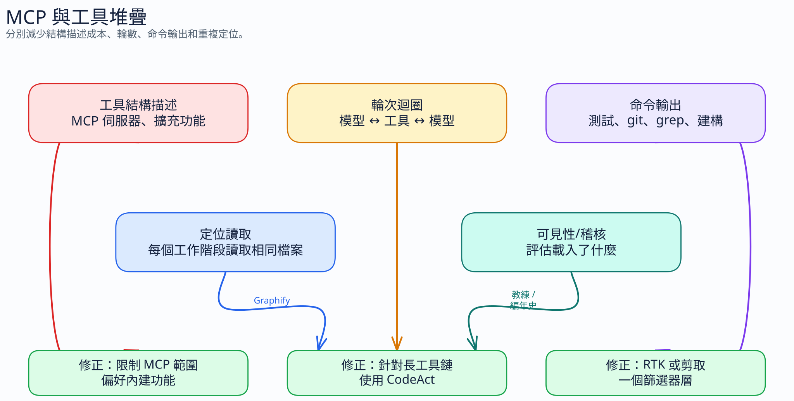

# 2.7 工具和 MCP 伺服器成本 —— 隱藏的 Token 稅

[← 返回指南](index.md)

---

## 在優化之前：衡量實際載入的內容

大多數上下文浪費都隱藏在你從未檢查過的事物中。在調整 MCP 伺服器或指令文件之前，請檢查上下文窗口中到底有什麼。



**Copilot CLI：** 在會話中運行 `/context` 以獲取真實的細分：

```text
Context Usage  claude-opus-4.6 · 104k/200k tokens (52%)
System/Tools:  62.5k (31%)   ← 始終載入：MCP + 指令 + 系統提示詞
Messages:      41.8k (21%)   ← 對話歷史
Free Space:    55.3k (28%)
Buffer:        40.4k (20%)
```

**VS Code Copilot：** 無對應指令，但你可以透過計算活躍的 MCP 伺服器數量 × 工具數量 × 平均每工具約 200 Token（見 §2.7.2）來估算你的 `System/Tools` 基準值。同時審計會新增技能、代理、MCP 伺服器或工具介面的擴充功能。如果某個擴充功能注入了你編碼時不需要的工具，請在該工作區停用它們，或將編碼工作移至僅啟用必要項目的 VS Code 設定檔中。

**關鍵區別 —— 始終載入 vs. 按需載入：**

| 組件 | 載入時機 | 是否在上下文窗口中？ |
|-----------|:-----:|:------------------:|
| MCP 工具定義 | 每條消息 | ✅ 是 |
| 代理指令 / `copilot-instructions.md` | 每條消息 | ✅ 是 |
| 系統提示詞 | 每條消息 | ✅ 是（不可控） |
| Copilot CLI 技能 (`.copilot/skills/`) | 僅在請求時 | ❌ 僅在磁碟上 |
| 對話歷史 | 隨輪數累積 | ✅ 是 |

存儲在 `.copilot/skills/` 中的技能 —— 即使在磁碟上有數百 KB —— 對 `System/Tools` 基準的貢獻也為 **零**。優化技能可以提高單個代理的啟動速度，而不是上下文餘裕。MCP 插件和指令文件才是移動 `System/Tools` 基準的槓桿。

> **在開始之前設定好這個基準值 —— 不要中途更改。** 因為 `System/Tools` 位於每個請求的最前端，它也是可快取的前綴。在對話中切換 MCP 伺服器/工具或切換自定義代理會重寫該前綴，導致快取的節省失效，並使先前的上下文在新的工具集下變成污染。請預先選擇好你的 MCP/工具和代理設定；如果你確實需要不同的設定，請開啟一個新的會話。請參閱 [快取 §2.3.5](04-context-management.md#235-caching-store-and-reuse-context-within-prompts)。

> Dina Berry（Microsoft/GitHub 內容貢獻者）審計了一個真實的 Copilot CLI 生產環境，發現一個 Azure 插件預設每條消息會載入約 27K 個 Token —— 在她運行 `/context` 之前，這一直都是不可見的。[完整文章 →](https://dfberry.github.io/2026-05-06-tuning-up-copilot-context)

---

## 2.7.1 每個工具都會消耗 Token

當你在 VS Code 中啟用 MCP 伺服器或工具時，其**整個定義** —— 函數名稱、描述、參數的 JSON Schema —— 都會被載入到代理的上下文中。每一步，每一次。

這並非免費。每個工具定義的成本大約為：

| 組件 | ~Token |
|-----------|:-------:|
| 工具名稱 + 描述 | 20-50 |
| 參數架構 (簡單) | 30-80 |
| 參數架構 (複雜) | 100-300 |
| **每個工具總計** | **100-500** |

## 2.7.2 乘法問題

這就是為什麼它會變得昂貴：

```text
載入的工具總成本 = 伺服器數 × 每個伺服器的工具數 × 平均每個工具的 Token 數

範例 (重度設置)：
  10 個 MCP 伺服器 × 每個伺服器 5 個工具 × 平均每個工具 200 Token = 10,000 Token

代理模式 (Agent mode) 每個任務運行 5-25 個步驟。
工具定義在每一步都會重新載入。

10,000 Token × 15 個步驟 = 150,000 個 Token，僅用於告知代理存在哪些工具。
這是在任何實際工作發生之前。
```

## 2.7.3 工具調用成本

除了定義之外，每次工具*調用*也會消耗 Token：

| 階段 | 成本 |
|-------|------|
| 函數名稱 + 參數 (輸出 Token) | 每次調用 20-200 |
| 結果解析 (輸入 Token，下一步) | 每次調用 50-2,000+ |
| 代理推理應使用哪個工具 | 每步 50-200 |

一個 `read_file` 調用可能只需花費 50 個 Token 來調用，但會返回 2,000 個 Token 的文件內容。然後代理在下一步中會處理所有這些內容。

## 2.7.4 對比前後：MCP 伺服器審計

**之前 —— "我啟用了所有功能" (15 個 MCP 伺服器)：**

| 伺服器 | 工具數 | ~每步 Token |
|--------|:-----:|:------------:|
| GitHub | 40 | 4,000 |
| Filesystem | 8 | 800 |
| Docker | 12 | 1,200 |
| Database (Postgres) | 10 | 1,000 |
| Database (Redis) | 8 | 800 |
| Slack | 15 | 1,500 |
| Jira | 12 | 1,200 |
| AWS | 20 | 2,000 |
| GCP | 18 | 1,800 |
| Kubernetes | 15 | 1,500 |
| Monitoring (Datadog) | 10 | 1,000 |
| Email | 8 | 800 |
| Calendar | 6 | 600 |
| Search (Brave) | 3 | 300 |
| Context7 | 2 | 200 |
| **總計** | **187** | **~17,700** |

在 15 個代理步驟中：僅工具架構就消耗了 **265,500 個 Token**。

**之後 —— "僅保留編碼所需的" (3 個 MCP 伺服器)：**

| 伺服器 | 工具數 | ~每步 Token |
|--------|:-----:|:------------:|
| GitHub | 40 | 4,000 |
| Context7 | 2 | 200 |
| Filesystem | 8 | 800 |
| **總計** | **50** | **~5,000** |

在 15 個代理步驟中：工具架構消耗了 **75,000 個 Token**。

**節省：每個代理任務節省 190,500 個 Token。** 僅工具定義產生的 Token 開銷就減少了 72%。

## 2.7.5 針對工作區配置 MCP 伺服器

不要在全球範圍內啟用所有 MCP 伺服器。請使用工作區級別的配置：

**全局配置** (`settings.json` 使用者設置) —— 僅限普遍需要的伺服器：

```json
{
  "mcp": {
    "servers": {
      "github": {
        "command": "github-mcp-server",
        "args": ["stdio"]
      }
    }
  }
}
```

**特定工作區配置** (`.vscode/mcp.json`) —— 僅限專案特定的伺服器：

```json
{
  "servers": {
    "postgres": {
      "command": "mcp-server-postgres",
      "args": ["postgresql://localhost/mydb"]
    }
  }
}
```

**規則：** 如果當前任務不需要它，請禁用它。你以後隨時可以重新啟用。每個閒置的 MCP 伺服器在代理的每一步都會消耗 Token。

**VS Code 擴充功能也算在內。** MCP 伺服器是工具架構的明顯來源，但有些擴充功能也會增加技能、聊天參與者、代理設定檔或工具介面，這些都可能出現在 AI 上下文中。對於成本敏感的編碼工作階段，請保持精簡的 VS Code 設定檔：僅保留核心語言工具、GitHub Copilot 以及該儲存庫所需的 MCP/工具。在工作區或設定檔層級停用其他所有項目。

## 2.7.6 實踐建議

1. **審計你的 MCP 伺服器** —— 檢查你啟用的伺服器。你真的在用所有的伺服器嗎？禁用其餘的
2. **基於任務啟用** —— 正在進行資料庫遷移？啟用 Postgres MCP。完成後？禁用它
3. **首選內置工具** —— VS Code 的內置工具（文件讀/寫、終端機、搜索）已經被載入到代理中。在之上添加一個 MCP 文件系統伺服器是冗餘的
4. **注意工具數量** —— 如果你啟用了 100 多個工具，那麼每一步僅在定義上就會增加數千個 Token
5. **自定義指令有幫助** —— 添加 "Minimize tool calls. Read files only when necessary." 以減少調用頻率
6. **對於偶爾使用的功能，使用技能 (skills) 而非 MCP** —— 無論是否使用，MCP 工具架構在每步都會載入。技能僅在預先載入標題和描述；完整內容按需提取。如果一個功能在不到一半的會話中使用，技能的上下文開銷更低。參見 [實踐設置 §4.2](10-practical-setup.md#mcp-vs-技能渴望式載入-vs-延遲式上下文載入) 以獲取完整對比
7. **可選，僅限 Copilot CLI：針對長工具鏈嘗試 CodeAct** —— 外部插件 [`copilot-codeact-plugin`](https://github.com/jsturtevant/copilot-codeact-plugin) 將許多小型工具跳轉合併為一次沙盒執行。這不會縮小任何伺服器的架構，但可以減少在 CLI 密集型任務中重複播放完整工具目錄的頻率
8. **針對重複的編碼工作流程使用專注的自定義代理** —— 自定義代理可以攜帶精簡的工具列表和穩定的指令，因此相同的編碼工作流程會以相同的活動介面開始，而不是預設聊天目前顯示的任何內容。在你的 Copilot 介面支援代理/設定檔中的模型選擇時，也在那裡固定預期的模型。
9. **在源頭使用 RTK 或 snip 壓縮工具輸出** —— [RTK (Rust Token Killer)](https://github.com/rtk-ai/rtk) 和 [`snip`](https://github.com/edouard-claude/snip) 是 CLI 代理，可在 Shell 命令的*結果*到達代理之前對其進行過濾。減少量是真實存在的，但取決於命令、專案輸出量和掛鉤 (hook) 的可靠性。參見 §2.7.7 和 §2.7.8
10. **在添加更多工具之前使用最小上下文技能 (minimal-context skills)** —— [`minimal-context-tools`](https://github.com/SebastienDegodez/copilot-instructions/tree/main/plugins/minimal-context-tools) 為 `rg`、`fd`、`jq`、`yq`、`ast-grep` 和相關 CLI 封裝了技能。這種模式成本低廉，因為它引導代理在產生任何大型輸出之前執行精確的一次性命令。當 Shell 輸出仍然吵雜時，請將其與 RTK/snip 配合使用。

## 2.7.7 在源頭壓縮工具輸出：RTK

MCP 架構開銷是*在工作開始前*的成本。分別地，代理運行的每個 Shell 命令都會產生輸出，這些輸出成為下一步的輸入 Token。在大型 PR 上失敗的 `cargo test` 或 `git diff` 可能會返回 10,000–25,000 個原始文本 Token —— 通過的測試行、未更改的 diff 上下文、構建噪音 —— 代理會完整地閱讀這些內容。

Copilot 已經具備了架構層級的節省機制：提示詞快取 (prompt caching)、延遲工具架構載入、WebSocket 傳輸、上下文壓縮以及大型輸出上限。這些功能無法取代輸出過濾器。VS Code 的終端機工具使用硬性的頭/尾風格輸出限制；Copilot CLI 也會警告模型限制輸出，並使用 `head`、`tail`、`grep` 或 `awk` 進行過濾。這是有用的安全網行為，而非語義解析。RTK 和 snip 的作用更早：它們在架構必須截斷輸出之前，將冗長的命令輸出轉換為較小的領域特定摘要。

[**RTK (Rust Token Killer)**](https://github.com/rtk-ai/rtk) 是一個位於 Shell 和代理之間的 CLI 代理。它運行原始命令，捕獲輸出，應用針對特定命令的過濾器（移除噪音、僅保留失敗的測試、去重日誌行、對文件列表進行分組），並返回壓縮後的結果。代理看到的輸出更小，而其行為保持不變。

**工作原理（按步驟）：**
1. 代理發出 Bash 工具調用 (`git status`, `cargo test` 等)
2. RTK 鉤子攔截並重寫為 `rtk git status` / `rtk cargo test`
3. RTK 運行真實命令並捕獲完整輸出
4. RTK 應用特定於命令的過濾器
5. 代理接收過濾後的結果 —— 語義等效，但內容更短

**估計的輸出減少量**（RTK 在中型 TypeScript/Rust 專案上的基準測試 —— 實際節省取決於你的專案輸出量）：

| 命令 | 原始輸出 | 使用 RTK 後 | 減少比例 |
|---------|:-----------:|:--------:|:---------:|
| `ls` / `tree` | ~2,000 Token | ~400 | -80% |
| `git status` | ~3,000 Token | ~600 | -80% |
| `git diff` | ~10,000 Token | ~2,500 | -75% |
| `cargo test` / `npm test` | ~25,000 Token | ~2,500 | -90% |
| `grep` / `rg` | ~16,000 Token | ~3,200 | -80% |
| `git log -n 10` | ~2,500 Token | ~500 | -80% |

這些減少在實踐中是真實的。具有冗長輸出的命令（測試失敗、大型 diff）獲得的收益最大；輸出簡短的命令獲得的絕對數字較小。

**安裝：**

```bash
# macOS
brew install rtk

# Linux / macOS
curl -fsSL https://raw.githubusercontent.com/rtk-ai/rtk/refs/heads/master/install.sh | sh
```

**Windows 注意事項：** RTK 目前在類 Unix 的 Shell 路徑上表現最強。在 Windows 上，Shell hook 行為和路徑處理可能會變得脆弱，特別是在 PowerShell、Git Bash、WSL 和 VS Code agent 執行之間。請將其視為試驗性質，而非預設建議：請在您的團隊使用的確切存儲庫和 Shell 上進行測試；如果設置導致命令失敗或產生雜訊，請跳過它。

**為 Copilot 設置：**

RTK 會安裝 PreToolUse hook 與提示說明。專案範圍的設定會寫入 `.github/`；較新的 RTK 版本也記錄了全域 Copilot 安裝路徑 `~/.copilot/` / `$COPILOT_HOME`。由於 hook 合約的變更速度快於靜態文件， rollout 前請先在你的 Copilot 環境中驗證。

```bash
cd your-repo
rtk init --copilot

# 若你的 RTK 版本支援，可選的全域 Copilot 設定：
rtk init -g --copilot
```

啟用後，hook 是透明的：你的終端機命令不受影響；僅攔截 agent 的 Bash tool calls。如果你的環境無法可靠支援全域 Copilot hook 路徑，請保留每專案設定，並為每個團隊工作區記錄該設定。

**其他 AI 工具（支援全域安裝）：**

```bash
rtk init -g                   # Claude Code（全域）
rtk init -g --gemini          # Gemini CLI（全域）
rtk init -g --agent cursor    # Cursor（專案層級）
rtk init --agent cline        # Cline / Roo Code（專案層級）
```

**作用範圍：** hook 攔截的是 agent 發出的 **Bash tool calls**。VS Code Copilot 的內建工具（`Read`、`Grep`、`Glob`）不經過 Bash，因此不受影響。若你特別需要 RTK 過濾，請使用 shell 等效命令（`cat`、`rg`、`find`）。

**與 MCP 縮減搭配使用：** Schema 審計（§2.7.4–2.7.6）削減每次步驟重新載入的定義成本。RTK 則削減每次 tool call *回傳的內容*。兩者針對 token 預算的不同部分，協同運作。

## 2.7.8 RTK 替代方案：snip

[`snip`](https://github.com/edouard-claude/snip) 解決了與 RTK 相同類型的问题：Shell 命令仍然正常運行，但代理接收的是過濾後的結果，而不是原始且雜訊較多的輸出。主要差異在於可擴展性。RTK 提供編譯好的 Rust 指令檔註冊表；snip 使用宣告式的 YAML 過濾器，使用者和團隊可以在不修改 Go 程式碼的情況下進行添加。

**當 snip 最具吸引力時：**

- 你希望為專案特定的工具設定自定義過濾器
- 你想透過 `snip gain` 查看本地的節省統計數據
- 你偏好使用 YAML 過濾器貢獻而非編譯好的指令規則
- 你需要 Copilot CLI 的 hook 支援，並且能夠驗證環境中的 hook 路徑

**安裝：**

```bash
brew install edouard-claude/tap/snip
# 或
go install github.com/edouard-claude/snip/cmd/snip@latest
```

**Copilot 設定：**

```bash
snip init --agent copilot
```

撰寫本文時，snip 的 Copilot 路徑會為 Copilot CLI 寫入一個 `preToolUse` hook。VS Code Copilot 的代理 hook 仍在快速變動中，因此除非你的團隊已驗證確切的版本和工作區設定，否則請將 VS Code 設定視為測試性質。

**過濾器模型：**

```yaml
name: "git-log"
match:
  command: "git"
  subcommand: "log"
pipeline:
  - action: "head"
    n: 20
```

Snip 支援多種管線操作，包括保留或移除符合條件的行、頭/尾截斷、ANSI 字元去除、JSON 提取、正則表達式提取、分組、去重、聚合以及模板。專案層級的過濾器需要信任批准，這是團隊的正確預設值：輸出過濾器會影響模型所見的內容，因此應像工具配置一樣進行審查。

**RTK 與 snip 比較：**

| 選擇 | 適用情境 |
|------|----------|
| RTK | 你希望使用單一 Rust 二進制檔案、廣泛的代理支援以及編譯好的預設值 |
| snip | 你希望使用 YAML 過濾器、本地統計數據以及更簡單的專案/團隊客製化 |

預設情況下，不要在同一個指令路徑上同時疊加 RTK 和 snip。針對每個代理介面選擇一種輸出過濾器層級，然後進行測量。疊加使用可能會導致輸出被雙重截斷，並增加除錯難度。

## 2.7.9 周邊生態系：其他應納入心智模型的項目

並非所有的 Token 工具都是 RTK/snip 的直接替代品。請將這些類別分開看待：

| 工具 | 類別 | 用途 | 注意事項 |
|------|------|------|----------|
| [`snip-ai/snip`](https://github.com/snip-ai/snip) | 專注於 Claude Code 的輸出過濾器 | 使用 AST 感知代碼處理來優化 Read/Bash/Grep/Glob | 與 `edouard-claude/snip` 是不同的專案；尚未驗證 Copilot 路徑 |
| [Redcon / ContextBudget](https://github.com/natiixnt/ContextBudget) | 上下文打包 + 指令壓縮 | 希望擁有指令壓縮器加上 CI 品質檢查的團隊工作流程 | 部署前應審查授權與產品邊界 |
| [Headroom](https://github.com/headroomlabs-ai/headroom) | 全棧壓縮包裝 | 更廣泛的文件、指令、記憶體和 MCP 壓縮實驗 | 在記錄為標準設定前，請驗證 `headroom wrap copilot` |
| [Tokalator](https://github.com/vfaraji89/tokalator) | VS Code Token 可見性 | 預算儀表板、模型/上下文視窗感知、指令文件掃描 | 僅供監控；不具備壓縮功能 |
| [token-optimizer](https://github.com/alexgreensh/token-optimizer) | 上下文審計/狀態工具 | 審計過時的記憶體、配置、壓縮損失和模型路由 | 採用 PolyForm Noncommercial 授權 |
| [Caveman](https://github.com/JuliusBrussee/caveman) | 模型輸出壓縮 | 更短的助手回應和簡潔風格包 | 不會減少 Shell 指令輸入；提示詞開銷值得注意 |
| [ACON](https://github.com/microsoft/acon) | 研究框架 | 長週期上下文壓縮的學術基礎 | 非即插即用的開發者工具 |

實用的堆疊策略是：保持 Copilot 的基礎架構穩定，減少始終載入的 MCP/Schema 開銷，引導代理使用精確的指令，然後在指令輸出仍然龐大時使用一種語義輸出過濾器。

## 2.7.10 案例研究：縮減大型插件的範圍 —— Azure MCP

單個插件可能會主導你的 `System/Tools` 預算。Dina Berry（Microsoft/GitHub 內容貢獻者）使用 `/context` 審計了她的 Copilot CLI 設置，發現 Azure MCP 插件預設會載入 **約 27K 個 Token/消息** —— 超過她所有其他 MCP 伺服器的總和。

原因：Azure MCP 伺服器 (v3.0.0-beta.6) 在 56 個命名空間中暴露了 259 個工具。在其預設的 `namespace` 模式下，它已經按服務分組，但如果你只使用少數幾個 Azure 服務，那麼大多數架構在每條消息中都是噪音。

**選項 A —— 完全禁用**（如果你在本次會話中不需要 Azure）：

```json
// ~/.copilot/settings.json
"azure@azure-skills": false
```

結果：每條消息立即釋放約 27K 個 Token。

**選項 B —— 命名空間範圍限制（推薦）：**

Azure MCP 團隊專門為此構建了 `--namespace` 過濾。聲明你實際使用的服務：

```bash
# 在你的 MCP 伺服器配置參數中：
--namespace appservice --namespace cosmos --namespace keyvault --namespace storage
```

這會載入約 24 個工具（4 個命名空間），而非全部 56 個命名空間。你需要的功能保留下來；其餘的則不載入。

**常見開發堆疊：**

| 角色 | 建議保留的命名空間 |
|---------|-------------------|
| Web 應用 | `appservice`, `cosmos`, `keyvault`, `storage`, `functions` |
| 數據/分析 | `cosmos`, `sql`, `kusto`, `eventhubs`, `storage` |
| DevOps/基礎設施 | `compute`, `aks`, `azureterraform`, `deploy`, `monitor` |
| AI/ML | `foundryextensions`, `search`, `speech`, `applicationinsights` |

**Azure MCP 伺服器模式**（控制工具的暴露方式）：

| 模式 | 暴露的工具 | 上下文成本 |
|------|:------------:|:------------:|
| `namespace` (預設) | 每個服務命名空間一個工具 | 中等 |
| `consolidated` | 按使用者意圖分組 | 較低 |
| `single` | 所有內容一個路由工具 | 最低 |
| `all` | 每個操作作為單獨工具 (259) | 非常高 |

**VS Code：** 在視覺上縮減 Azure MCP 範圍 —— 聊天面板旁邊的齒輪圖示 → 在伺服器、命名空間或單個工具級別選擇/取消選擇。無需配置文件。

**來自 Dina Berry 設置的實測結果：**

```text
之前 (預設配置)：    System/Tools 62.5k (31%) — Free Space 28%
之後 (限定 Azure)：  System/Tools 35.2k (18%) — Free Space 45%
之後 (+ 精簡指令)： System/Tools 25.5k (13%) — Free Space 67%
```

普遍的教訓：當 `System/Tools` 很高時，請在執行其他操作前先審計插件。一個大型插件消耗的成本通常比其餘設置的總和還要多。完整文章：[dfberry.github.io](https://dfberry.github.io/2026-05-06-tuning-up-copilot-context)。

---

**下一頁：** [對比與數據 →](09-comparisons-data.md)
