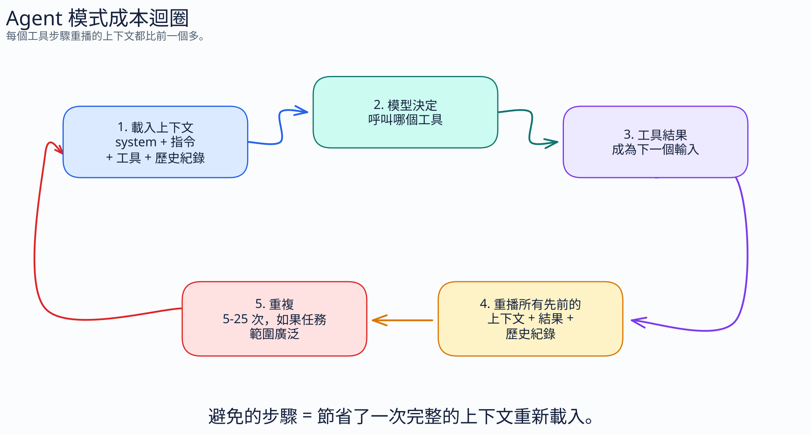
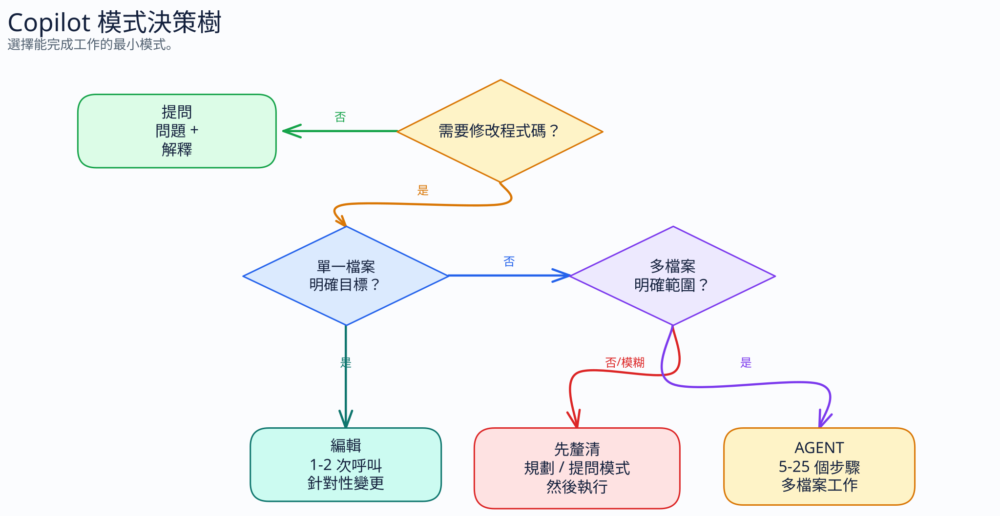

# Part 4: 實務設定

[← 回到指南](index.md)

---

## 4.1 設定 GitHub Copilot 以提升 Token 效率

### 步驟 1：建立 `copilot-instructions.md`

在您的專案儲存庫根目錄中建立 `.github/copilot-instructions.md`。此檔案會在專案中的每一次 Copilot 互動時載入。

```bash
mkdir -p .github
touch .github/copilot-instructions.md
```

**入門範本（Token 最佳化）：**

```markdown
精簡如原始人。技術實質精確。只留下乾貨。
丟棄：冠詞、贅詞（just/really/basically）、客套話、推託詞。
接受不完整句子。簡短同義詞。程式碼保持不變。
模式：[事物] [動作] [原因]。[下一步]。
每次回覆皆生效。多次對話後不恢復。不漂移贅詞。
程式碼/提交/PR：正常。關閉選項："stop caveman" / "normal mode"。
```

這大約是 50 個 token。自然英文的同等內容需要 120 個以上的 token。您在每次互動中都能節省 70 個以上的 token。

### 步驟 2：新增專案專屬指令（壓縮版）

以同樣的壓縮格式新增您的專案脈絡：

```markdown
技術疊代：Node.js 20, TypeScript 5.4, PostgreSQL 16, Redis。
測試：Vitest。Lint：ESLint flat config。
風格：功能性核心，命令式外殼。無類別。
命名：變數/函式使用 camelCase，型別使用 PascalCase，常數使用 UPPER_SNAKE。
錯誤：Result<T,E> 模式，商務邏輯中不拋出例外狀況。
```

對比自然英文版本：

```markdown
這個專案使用 Node.js 版本 20 與 TypeScript 5.4。我們使用 PostgreSQL 16
作為我們的主要資料庫，並使用 Redis 進行快取。對於測試，我們使用 Vitest，而
對於 linting，我們使用 ESLint 搭配新的 flat 設定格式。

我們遵循功能性核心、命令式外殼的架構。請不要使用
類別。對於變數與函式命名，使用 camelCase。型別應該使用
PascalCase，而常數應該使用 UPPER_SNAKE_CASE。

對於錯誤處理，我們使用 Result<T,E> 模式。不要在
商務邏輯程式碼中拋出例外狀況。
```

兩者傳達完全相同的資訊。壓縮版本約為 40 個 token。詳細版本約為 110 個 token。**節省 64%，應用於每次互動。**

### 步驟 3：選擇您的預設模式

In VS Code, Copilot Chat offers mode selection. Default strategy:

| 工作類型 | 模式 | 原因 |
|-----------|------|-----|
| 快速發問 | Ask | 單次 LLM 呼叫，無工具額外開銷 |
| 程式碼解釋 | Ask | 無需修改檔案 |
| 錯誤診斷 | Ask（通常） | 您提供上下文資訊 |
| 單一檔案變更 | Edit | 具針對性，額外開銷極小 |
| 多檔案重構 | Agent | 需要跨檔案讀取/寫入 |
| 新功能實作 | Agent | 多步驟建立 |
| Issue 到 PR 的自動化 | Coding Agent | 完全自主的工作流程 |

### 步驟 4：策略性選擇模型

GitHub Copilot pricing depends on model choice and billing mode. Pick the model whose cost matches the *level of effort* the task actually needs. For the pricing details and billing timeline, see [模型選擇與定價](11-models-and-pricing.md)。

| 模型層級 | 相對 Token 成本 | 用於 |
|------------|:------------------:|---------|
| 輕量級 (GPT-4.1 mini, Haiku) | 最低 | 自動完成、簡單語法、查詢式問題 |
| 標準級 (GPT-4.1, Sonnet) | 中等 | 大多數程式設計工作 — 實作、重構、修正 |
| 高努力度級 (Claude Opus, o 系列推理) | 最高 | 架構、深度推理、新穎問題分解 |
| **Auto** | 預設為 low | 預設：Copilot 從支援的 Auto 池中選擇，並在符合條件時套用付費方案折扣 |

**預設為 Auto。** Auto 是最佳的通用基準，因為它能減少挑選疲勞，並且在符合條件的付費方案使用中，會套用 GitHub 所說明的折扣。將 Auto 視為預設通道，而不是自動升級到所有高努力度模型。如果您需要優質的高努力度模型，請手動釘選。參閱 [模型選擇與定價](11-models-and-pricing.md)。

**絕不要在「X 的語法是什麼」這類問題上浪費高努力度模型** — 您為最便宜模型就能正確回答的問題支付了更高的 Token 費率。

### 長對話工作階段的快取保護規則

為長對話執行緒選擇通道後，請保持其穩定：

```text
{ model, active MCP set, active agent/profile }
```

除非必要，否則請勿在昂貴的對話途中變更這些控制項。對話途中切換通常會使快取的字首失效，並移除您已建立的快取輸入折扣。

如果必須切換，請改做以下步驟：

1. 擷取簡短的交接摘要（決策、限制、後續動作）。
2. 使用新通道開始新的聊天。
3. 僅貼上摘要與必要的檔案。

### 步驟 5：依工作混合使用模型（模型路由）

一個有用的成本槓桿：在同一個工作流程中**針對不同的子工作使用不同的模型**。詳細的定價脈絡、歷史倍數參考、方案可用性以及官方 GitHub 文件連結現在皆位於 [模型選擇與定價](11-models-and-pricing.md)。本節將重點放在實務的路由習慣上。

#### 模型混合策略

將模型與工作的認知需求相匹配：

| 工作類型 | 建議模型 | 相對成本 | 原因 |
|-----------|:-----------------:|:-------------:|-----|
| 「這個函式做什麼用？」 | GPT-4.1 / GPT-5 mini | **內建** | 知識檢索，不需要推理 |
| 「X 的語法是什麼？」 | GPT-4.1 / GPT-5 mini | **內建** | 記憶性知識 |
| 快速解釋、摘要 | Claude Haiku 4.5 | **0.33x** | 快速、便宜、足夠好 |
| 程式碼審查、lint 建議 | Claude Haiku 4.5 | **0.33x** | 模式比對，而非深度推理 |
| 實作功能、修正 bug | Claude Sonnet 4.5 | **1x** | SWE-bench 顯示這是實用的預設值 |
| 多檔案重構 | Claude Sonnet 4.5 | **1x** | 在實際程式設計工作上與 Opus 相當 |
| 架構決策、系統設計 | Claude Opus 4.6 | **3x** | 深度推理證明其成本合理 |
| 從規格進行複雜的多步驟規劃 | Claude Opus 4.6 | **3x** | 新穎的問題分解 |
| 安全性稽核、威脅建模 | Claude Opus 4.6 | **3x** | 細節與徹底性至關重要 |

#### 實際節省範例

典型每日工作流程（30 次互動），以標準層級等效 Token 成本表示：

| 不混合使用（全 Sonnet） | 混合使用 | 節省 |
|:---------------------------:|:-----------:|:-------:|
| 30 × 1x = **30 個成本單位** | 10 × 內建 + 8 × 0.33x + 10 × 1x + 2 × 3x = **18.6 個成本單位** | **38%** |

如果您對所有事情都使用 Opus：30 × 3x = 90 個成本單位。混合使用降至 18.6 — 相對模型成本**降低了 79%**。

#### 自動模型選擇應為您的預設設定

Copilot 的 **Auto** 模式會根據即時系統健全狀況與模型效能，從支援的 Auto 選擇池中挑選。在付費方案上，GitHub 說明了 Copilot Chat 中符合條件的 Auto 使用可享有 **10% 折扣**。將 Auto 視為預設的低摩擦通道；成本較高的優質模型仍需手動釘選。

**預設為 Auto。僅在需要時覆寫。** 對於團隊來說，這是一個高槓桿的預設設定，因為它能將日常預設保持在較低成本的通道。除非您有特定原因要釘選模型，否則請使用 Auto — 例如，您*知道*工作很瑣碎（強制作為最便宜的層級），或者您*知道*它需要深度推理（手動釘選到優質模型）。如需確切權衡，請參閱 [模型選擇與定價](11-models-and-pricing.md)。

#### 反模式：所有事都用高努力度模型

一個昂貴的習慣：在每次互動中都預設使用 Opus 或其他高努力度模型。人們這樣做是因為「更好的模型 = 更好的結果」。對於大多數日常程式設計工作，額外的模型成本很難證明其合理性。

保留高努力度模型以發揮其真正的優勢：新穎的推理、架構判斷，以及 1-2% 的品質差異足以證明 3-5 倍成本增加合理的工作。

#### 推理努力度：另一個槓桿

除了模型選擇之外，在具備推理模型的系列上還存在第二個成本調整盤：**思考努力度**（或稱**推理努力度**）。這控制了模型在回應前花費多少 token 進行思考 — 同時影響文字、工具呼叫與延伸思考。

| 努力度層級 | 行為 | Anthropic 建議用途 |
|:------------:|----------|----------------------------|
| `max` | 對 token 支出不加限制 | 最深度的推理、徹底的分析 |
| `high`（預設） | 總是深入思考 | 複雜推理、困難的程式設計、代理工作 |
| `medium` | 中等 token 節省，可能跳過思考 | **Anthropic 針對 Sonnet 4.6 建議的預設值** — 代理程式設計、重度使用工具的工作流程、程式碼生成 |
| `low` | 顯著 token 節省，對於簡單工作跳過思考 | 高量、延遲敏感、聊天、簡單分類 |

來源：[Anthropic Effort Parameter Docs](https://platform.claude.com/docs/en/build-with-claude/effort)，2026 年 4 月；[VS Code Language Models Docs](https://code.visualstudio.com/docs/copilot/concepts/language-models)，2026 年 4 月；[GitHub Copilot CLI programmatic reference](https://docs.github.com/en/copilot/reference/copilot-cli-reference/cli-programmatic-reference)，2026 年 4 月。

Anthropic 文件的關鍵事實：

- **努力度影響一切**，而不僅僅是思考 token。較低的努力度 = 較短的文字回應、較少的工具呼叫、採取行動前較少的序言。這是一個比 `budget_tokens` 更廣泛的槓桿。
- **Anthropic 建議 `medium` 作為 Sonnet 4.6 的預設值**，而非 `high`。他們的官方文件明確指出，medium 是「大多數應用程式（包括代理程式設計）的速度、成本與效能的最佳平衡」。
- **在許多支援推理的模型系列中公開於 Copilot。** 在 VS Code 中，思考努力度會出現在支援的推理模型（如 Claude Sonnet/Opus 推理變體與 GPT 推理模型）。非推理模型（如 GPT-4.1 與 GPT-4o）則不會顯示該控制項。在 Copilot CLI 中，某些模型也支援在設定中調整 `reasoning_effort`。
- **無需啟用延伸思考即可運作。** 您不需要開啟單獨的可見思考模式即可受益 — 努力度會控制整體的 token 支出。
- **無已發表的基準測試。** Anthropic 提供了定性指南（上表），但尚未發表關於品質與努力度權衡的具體數據。這是供應商建議，而非獨立基準測試。

**Copilot 確實在許多具備推理能力的模型上公開了此功能。** 在 VS Code 中，於模型挑選器中選擇一個推理模型，開啟其思考努力度子選單，然後選擇層級。這適用於以推理為導向的模型系列，包括 Claude Sonnet/Opus 推理模型以及支援的 GPT 推理模型；非推理模型（如 GPT-4.1 與 GPT-4o）則不顯示此子選單。在 Copilot CLI 中，某些模型也允許在設定中設定 `reasoning_effort`，GitHub 的文件以 `gpt-5.3-codex` 作為範例。同樣的槓桿也可以直接在 Claude API 及相關工具中使用。在同等程式設計工作下，`medium` 努力度的 Sonnet 與 `high` 努力度的 Opus 相比，仍可能代表 3-5 倍以上的總成本差異。

### 步驟 6：為您實際使用的模型重新調整指令

當您變更模型時，請勿assume舊的提示詞疊代仍是最佳的。供應商提示詞指南是版本專屬的，且經常解釋行為變更：冗長度、工具積極度、結構偏好、推理努力度以及停止條件。

快速工作流程：

```text
將官方指南 URL 貼入 Copilot。
指定目標模型與檔案。
要求 Copilot 在保留行為的同時調整提示詞/指令。
審查 diff；僅保留可減少錯誤嘗試的具體變更。
```

範例：

```text
目標模型：Claude Sonnet 4.6。
指南：https://platform.claude.com/docs/en/docs/build-with-claude/prompt-engineering/claude-4-best-practices
檔案：.github/copilot-instructions.md, .github/instructions/*.instructions.md
為此模型調整指令。保留儲存庫行為。減少重做。保持精簡。
```

有關供應商指南 URL 以及 Sonnet、GPT-5.5 與 Gemini 的並排範例，請參閱 [工作流程最佳化 §2.5.5](06-workflow-optimization.md#255-retune-prompts-to-the-target-model)。

### 步驟 7：在提示詞之外加入組織防護欄

不要試圖僅靠提示詞文字來解決治理問題。提示詞檔案塑造行為，但帳單控制項存在於其他地方。

如果您正在引導組織或企業進行推廣，請在此處停止並閱讀 [企業治理](12-enterprise-governance.md)。該章節主導了管理指南：AI 額度預算、每位使用者額度緊縮、模型存取權原則、組織指令以及獨立組織權衡。

本頁面用於從業人員的設定。企業章節用於客戶治理決策。

### 步驟 8：在 AI 工作前轉換非文字輸入

當工作流程從 `.docx`、`.pdf`、`.pptx`、`.xlsx`、HTML 匯出、圖片、音訊、影片或 ZIP 封存檔開始時，請在內容到達 Copilot 或 RAG 管道之前新增轉換步驟。豐富的格式帶有版面配置與 metadata，會膨脹輸入 token，而不會改善模型的理解。

[Marc Bara 的格式稅文章](https://medium.com/@marc.bara.iniesta/your-docx-is-wasting-33-of-your-ai-budget-86a3d229d042) 給出了操作原則：Markdown 應該是 AI 的工作格式，而 Word/PDF 僅在人類流程需要時保留為輸出格式。文章指出，一個 10 頁的 PDF 範例在乾淨轉換為 Markdown 後，從大約 12,400 個 token 降至 8,350 個 token — 相同內容的輸入減少了約 33%。

[Microsoft MarkItDown](https://github.com/microsoft/markitdown) 是建議優先嘗試的預設工具。它能將 PDF、Word、PowerPoint、Excel、圖片、音訊、HTML、CSV/JSON/XML, ZIP 內容、YouTube URL、EPUB 等轉換為 Markdown，以進行 LLM 與文字分析工作流程。

```bash
pip install 'markitdown[all]'

markitdown report.docx -o report.md
markitdown slides.pptx -o slides.md
markitdown spreadsheet.xlsx -o spreadsheet.md
markitdown source.pdf > source.md
```

對於生產線管道，請盡可能僅安裝所需的額外項目：

```bash
pip install 'markitdown[pdf,docx,pptx,xlsx]'
```

然後將 `.md` 檔案傳送給模型，對 `.md` 檔案進行分塊/索引以進行檢索，並僅在最終交付步驟重新生成 `.docx` 或 `.pdf`。對於未受信任的選取上傳，請先驗證路徑與 URL；MarkItDown 會以執行中程序之權限執行 I/O。

## 4.2 將可重複使用的指引保留在常駐上下文之外

此儲存庫不再提供可安裝的工作流程套件。但請保持相同的習慣：將偶爾使用的工作流程指引放在常駐提示詞之外，並僅在工作需要時才將其拉入。

適合的候選對象：

- PR 審查檢查表
- 版本發布或復原範本
- 除錯腳本
- 單一子系統的遷移說明

將它們儲存在您團隊存放可重複使用提示詞或操作說明的地方。Token 規則保持不變：如果某個規則在大多數互動中都不需要，就不要在每次互動中都為其付費。

### 適合重度 CLI 使用者的選用項目：CodeAct

如果您的大多數長時間工作都發生在 **Copilot CLI** 中，選用的外部外掛程式 [`copilot-codeact-plugin`](https://github.com/jsturtevant/copilot-codeact-plugin) 值得評估。它不是此儲存庫的一部分，也不是通用的 Copilot Chat 功能。其價值主張在於工作流程形式：將許多 `grep` / `view` / `bash` / MCP 步驟合併到單個沙箱化執行中，從而減少完整上下文與工具類別的重複播放次數。對於重度 CLI 的工作階段，可以使用它；如果您的工作主要是 IDE 聊天/編輯，或者您不想在路徑中加入外部外掛程式，請跳過它。

### MCP vs. Skills：積極 vs. 延遲的上下文載入

MCP（模型上下文協定伺服器，Model Context Protocol servers）在每次互動中都會將其**完整的工具 Schema** 注入上下文中 — 無論這些工具是否被使用。一個擁有 20 個工具的伺服器可能會在您對話工作階段的每次請求中增加數千個 token。

Skills 的運作方式不同：預設僅載入**標題與描述**。只有當該 skill 實際與當前工作相關時，才會按需提取完整的 skill 內容。

| 機制 | 每次對話載入內容 | 完整內容載入時機 |
|-----------|--------------------|--------------------------|
| **MCP** | 完整的工具 Schema（總是） | 不適用 — 始終存在 |
| **Skill** | 僅標題 + 描述 | 按需，在呼叫時載入 |

**規則：** 將 MCP 用於大多數互動所需的能耐。將 skills 用於偶爾使用的能耐 — 使用 MCP 您需要在每次對話中支付完整的 Schema 成本，但使用 skills 則僅在呼叫時付費。如果一個工具在 10 次對話中僅使用 1 次，那麼在上下文額外開銷上，skill 大約便宜 10 倍。

### 選用：minimal-context-tools

[`minimal-context-tools`](https://github.com/SebastienDegodez/copilot-instructions/tree/main/plugins/minimal-context-tools) 將此概念封裝為常用低 Token CLI 模式的 skills：`fd` 用於檔案探索、`rg` 用於目標文字搜尋、`jq`/`yq` 用於結構化資料、`ast-grep` 用於語法感知程式碼查詢，以及 `tokei` 用於程式碼統計。

將其用作行為層，而不是另一個常駐的 MCP 伺服器。其目的是讓代理在任何輸出過濾器執行之前提出更精確的問題。它與 RTK 或 snip 搭配良好：skills 減少了代理請求的內容；RTK/snip 則減少了返回的內容。

## 4.3 GitHub Coding Agent 考量因素

Coding Agent 執行的自主工作階段可以持續數分鐘到數小時。Token 節省效果會在這些長對話工作階段中累加。

### 4.3.1 壓縮 `copilot-instructions.md`

代理會讀取此檔案。壓縮後的指令檔案可以在每次內部規劃步驟中節省 token — 而且代理在每個工作階段中會執行許多步驟。

### 4.3.2 使用 `copilot-setup-steps.yml`

以確定性的方式預先安裝相依套件：

```yaml
# .github/copilot-setup-steps.yml
steps:
  - name: Install dependencies
    run: npm ci
  - name: Build
    run: npm run build
```

如果不這樣做，代理會透過嘗試錯誤法來探索並安裝相依套件 — 每次嘗試都會消耗 LLM 呼叫與 token。**節省：總工作階段 token 的 10-30%。**

### 4.3.3 撰寫精確的 Issue 描述

模糊的 issue 會導致代理廣泛探索程式碼庫（讀取許多檔案 = 許多 token），並可能誤解需求（重做 = 更多 token）。

**模糊的 issue：**

```text
修正登入 bug
```

**精確的 issue：**

```text
Bug：當電子郵件包含 '+' 字元時登入失敗。
檔案：src/auth/login.ts，第 42 行的 validateEmail()。
修正：在傳遞給 OAuth 供應商之前先對電子郵件進行 URL 編碼。
測試：在 login.test.ts 中為 "user+tag@example.com" 新增測試案例。
```

藉由減少探索與重做，**節省：20-50%** 的總工作階段 token。

### 4.3.4 精簡的 PR 留言與 Commit 訊息

代理會讀取 PR 審查留言與 git 歷程記錄以獲取上下文。代理在內化這些內容時，每一條詳細的 commit 訊息或審查留言都會消耗 token。請保持 commit 訊息與審查留言精簡。

### 4.3.5 自訂代理設定檔

針對不同的工作類型建立專注的指令，而不是使用單一巨大的指令檔案：

```text
# 用於撰寫測試的工作
Stack: Vitest + Testing Library. AAA pattern.
Mock: external services only. No impl mocking.
Coverage: branch coverage ≥80%.
```

與通用指令集相比，專注的代理所攜帶的指令額外開銷較少。它們還為您提供了一個穩定的控制介面：同一個工作設定檔可以宣告允許使用的工具、攜帶的指令，以及在您的 Copilot 介面支援時應使用的模型。對於重複的程式設計工作流程，當您關心可預測的成本時，請優先選擇專注的自訂代理，而非預設代理。預設代理會繼承更多當前環境：作用中的工具、擴充功能提供的介面以及當前選擇的模型。

保持工具清單精簡。此儲存庫的 `agents/token-saver.agent.md` 就是一個模式：內建 `bash`、`edit` 與 `view`；沒有重複的檔案系統 MCP；精簡的輸出規則；明確的工具最小化。

### 4.3.6 使用 RTK 壓縮 Shell 指令輸出

Coding Agent 在每個工作階段中會執行許多 shell 指令 — `git diff`、測試執行、`grep`、`ls`。每個指令的原始輸出都會作為下一個代理步驟的輸入 token 傳回。大型失敗測試套件或詳細的 git diff 可能會傳回數萬個 token。

[**RTK (Rust Token Killer)**](https://github.com/rtk-ai/rtk) 是一個 CLI 代理，可在這些輸出到達代理之前對其進行過濾。它執行原始指令、移除雜訊（通過的測試、未變更的 diff 行、建構產物），並傳回壓縮後的结果。代理的行為保持不變；它看到的是更小、更專注於訊號的輸出。

**針對 VS Code Copilot 的設定 — 每個儲存庫：**

```bash
brew install rtk   # 或：curl -fsSL https://raw.githubusercontent.com/rtk-ai/rtk/refs/heads/master/install.sh | sh

cd your-repo
rtk init --copilot
# 重新啟動 VS Code
```

RTK 會在當前儲存庫中安裝一個 PreToolUse 勾點。較新的 RTK 建構版本也說明了全域 Copilot 勾點路徑；在將其作為團隊預設值之前，請先在您的 Copilot 介面上驗證該路徑。啟用後，該勾點是透明的：您的終端機保持不變；僅攔截代理的 Bash 工具呼叫。

在 Windows 上，請先驗證 RTK，然後再將其推薦給團隊。在 PowerShell、Git Bash、WSL 與 VS Code 代理執行之間，該勾點路徑可能會更加脆弱。如果 RTK 增加了設定摩擦或指令失敗，請跳過它，並首先專注於乾淨的設定檔、較少的 MCP 伺服器、精確的提示詞與較短的指令輸出。

具有詳細輸出的指令（測試失敗、大型 diff）可獲得最大的縮減。短輸出指令的收益較小。實際節省量取決於您的專案輸出量。

與 `copilot-setup-steps.yml` (§4.3.2) 以及精確的 issue 描述 (§4.3.3) 結合使用，以獲得最大的工作階段效率。完整設定、指令清單及其他 AI 工具支援：[MCP 與工具成本 §2.7.7](08-mcp-tool-costs.md#277-compress-tool-output-at-the-source-rtk)。

### 4.3.7 使用 Graphify 建構持久的知識圖譜

RTK 壓縮 shell 指令傳回的內容。[Graphify](https://github.com/Graphify-Labs/graphify) 解決了不同的成本：代理在採取行動前為了理解結構而讀取專案檔案所花費的 token。

安裝一次：

```bash
uv tool install graphifyy
```

在儲存庫中建構或更新圖譜：

```bash
graphify .
```

然後查詢目標結構：

```text
graphify query "where is error handling for the API layer?"
graphify path "AuthService" "Database"
graphify explain "QueueWorker"
```

圖譜存在於 `graphify-out/graph.json` 中。人類可讀的地圖為 `graphify-out/GRAPH_REPORT.md`；視覺化探索器為 `graphify-out/graph.html`。

**最大收益：** 在大型儲存庫上的 Coding Agent 與代理模式工作階段，其中前幾個步驟通常是為了定向而讀取檔案。Graphify 會預先載入該結構化掃描一次，並將其攤銷到後續的工作階段中。

**團隊選擇：** 決定是否將 `graphify-out/graph.json` 與 `GRAPH_REPORT.md` 提交，以便代理共享相同的地圖，或者將 `graphify-out/` 納入 `.gitignore` 並讓每位開發人員在本地端建構。如果您的儲存庫原則將敏感的來源關係視為受限的 metadata，請勿提交這些圖譜。

**結合使用：**

- `copilot-setup-steps.yml` (§4.3.2)，以便在圖譜查詢發揮作用前，代理環境是確定性的
- 精確的 issue 描述 (§4.3.3)，以便代理查詢正確的子圖，而不是整個儲存庫地圖
- 全新的執行工作階段（[每個 Token 的成效](13-outcome-per-token.md)），以便圖譜補充簡短的計劃，而不是冗長的對話歷史紀錄

注意：程式碼解析對於 AST 階段是本地端的。針對文件、PDF、圖片或影片的選用性語意/深度擷取可能會使用已設定的 AI 後端。在專有程式碼庫上啟用額外功能之前，請先審查該邊界。

### 4.3.8 使用 snip 壓縮 Shell 指令輸出

[`snip`](https://github.com/edouard-claude/snip) 是針對 Copilot 導向之 shell 輸出壓縮，RTK 最接近的實用替代方案。它正常執行指令，透過宣告式 YAML 管道過濾輸出，並可以使用 `snip gain` 追蹤本地端節省的費用。

安裝：

```bash
brew install edouard-claude/tap/snip
# 或：
go install github.com/edouard-claude/snip/cmd/snip@latest
```

設定 Copilot CLI：

```bash
snip init --agent copilot
```

當您需要專案專屬或團隊維護的過濾器而不想重新編譯工具時，請使用 snip。過濾器可以比對指令/子指令並套用如 `head`、`tail`、`keep_lines`、`remove_lines`、`json_extract`、`regex_extract`、`group_by`、`dedup` 或 `aggregate` 等動作。

範例過濾器形狀：

```yaml
name: "my-test-summary"
match:
  command: "my-test-runner"
pipeline:
  - action: "keep_lines"
    pattern: "FAIL|ERROR|expected|actual"
  - action: "head"
    n: 80
```

**團隊推廣：** 從一個儲存庫與一個 shell 介面開始。驗證失敗的測試、diff 與建構錯誤是否仍保留足夠的詳細資訊，以便代理修正問題。預設情況下，不要在同一個指令路徑上啟用 RTK 與 snip；選擇一種過濾器層並進行評估。

### 4.3.9 使用工作階段套件檢查表

此處的「套件」並非單獨的安裝項目。它是代理工作階段周圍的穩定控制組：

```text
模型 + 模式 + 代理/設定檔 + 作用中 MCP/工具 + 輸出過濾器 + 儲存庫指令
```

在長時間執行代理之前，請先設定一次並保持穩定。在工作階段途中變更它們會使快取的字首失效，並使代理在新的工具集下攜帶過時的上下文資訊。

使用此檢查表：

1. 挑選模式：Ask/Edit/Agent/Coding Agent。
2. 挑選模型通道或 Auto。
3. 停用未使用的 MCP 伺服器與擴充功能提供的工具。
4. 如果需要，挑選一個指令輸出過濾器：RTK 或 snip。
5. 如果重複的程式碼庫定向佔據主導地位，請使用 Graphify。
6. 如果需要變更通道，請啟動全新工作階段。

## 4.4 建立習慣

### 從小處開始

1. **第 1 週：** 將壓縮的 `copilot-instructions.md` 新增至您的主要專案。對於簡單的問題使用 Ask 模式
2. **第 2 週：** 在提示詞中練習精簡語法。丟棄贅詞，保持精確
3. **第 3 週：** 晉升到完全精簡語法。丟棄冠詞，使用不完整句子
4. **第 4 週：** 在程式碼生成提示詞中新增「僅程式碼」。將可重複使用的精簡範本儲存在常駐上下文之外

### 每月維護

- 審查您的 `copilot-instructions.md` — 它是否膨脹了？將其重新壓縮
- 檢查是否有任何記憶檔案變得冗長 — 將其重新壓縮
- 稽核您的編輯器中習慣開啟哪些檔案 — 關閉您沒有在處理的檔案（開啟的頁籤會自動提供上下文資訊）
- 稽核 VS Code 設定檔與擴充功能 — 除非當前儲存庫需要，否則停用注入 AI skills、代理、MCP 伺服器或工具的擴充功能
- (商務/企業) 為新的敏感路徑審查儲存庫/組織的**內容排除**設定
- 檢查您的模型使用情況 — 您是否在 Auto 會路由到較便宜層級的工作上釘選了高努力度模型？
- In Copilot CLI, watch the bottom-right **AIC** counter. Divide by 100 for the approximate dollar value, then ask whether the output saved more time or cost than it consumed. If spend is high for weak output, treat that as feedback on prompt scope, context size, tool count, or model choice
- 在進一步擴大優質存取權限之前，先審查預算、使用者層級限制以及模型原則
- 當預設模型變更時，根據該供應商當前的提示詞指南重新調整提示詞/指令
- 檢查每位使用者/小組的 token 使用量 — 代理與進階使用者是否推動了過度消費？參閱 [企業治理](12-enterprise-governance.md)

### 何時調整

| 訊號 | 行動 |
|--------|--------|
| 得到錯誤的結果 | 退回一個壓縮層級 |
| 頻繁重複解釋 | 指令可能過於精簡 — 新增一行說明 |
| 達到速率限制 | 套用矩陣中的更多技術 |
| 新團隊成員感到困惑 | 在程式碼中加入完整的英文註解，保持指令壓縮 |
| 長對話代理工作階段失敗 | 檢查 issue 描述的精確度，新增 `copilot-setup-steps.yml` |

## 4.5 設定 Agent 模式以提升效率

### 4.5.1 Agent 模式 vs. Ask 模式 vs. Edit 模式

每種模式都有根本不同的 token 成本特徵：

| 模式 | 每次動作的 LLM 呼呼叫次數 | 工具使用 | 載入的上下文 | 最適合用於 |
|------|:--------------------:|:--------:|:--------------:|----------|
| **Ask** | 1 | 無 | 對話 + 指令 | 問題、解釋 |
| **Edit** | 1-2 | 檔案讀取/寫入 | 目標檔案 + 指令 | 單一檔案變更 |
| **Agent** | 5-25 | 完整工具集 | 所有內容 + 工具 Schema | 多步驟、多檔案工作 |

**成本加倍效果：** 在相同提示詞下，Agent 模式的成本是 Ask 模式的 5-25 倍。在 Agent 模式下提出簡單的問題會觸發檔案讀取、工具評估以及多步驟推理 — 這些對於「此函式做什麼用？」完全沒有必要。

### 4.5.2 Agent 模式內部迴圈

了解此迴圈有助於您將步驟減至最少：



**關鍵洞察：** 上下文會隨著每個步驟而增加。第 15 步會攜帶步驟 1-14 的所有上下文資訊加上原始提示詞。這就是長代理工作階段成本迅速攀升的原因。

### 4.5.3 將 Agent 步驟減至最少

每避免一個步驟，就能節省一次完整的上下文重新載入。技術包括：

**具有驗收標準的精確提示詞：**

```text
# 差 — 代理將探索、讀取檔案並猜測需求
"修正使用者註冊"

# 好 — 代理清楚知道要做什麼
"檔案：src/auth/register.ts 第 42 行。
 Bug：電子郵件驗證會拒絕有效的 '+' 字元。
 修正：使用 RFC 5322 正規表示式。
 測試：在 register.test.ts 中新增 'user+tag@example.com' 案例。
 完成條件：測試通過且沒有其他測試壞掉。"
```

精確版本可能在 3-5 步內完成。而模糊的版本則需要 10-20 步的探索。

**針對複雜工作的規劃檔案：**

在呼叫 agent 模式之前建立一個規劃：

```markdown
# plan.md
1. 將 `validateEmail()` 新增至 src/utils/validation.ts
2. 在 src/auth/register.ts 第 42 行中匯入並使用
3. 在 tests/auth/register.test.ts 中新增測試案例
4. 執行 `npm test` — 預期全部通過
```

然後提示：「執行 plan.md。」代理會遵循規劃，而不是自己去摸索路徑。更少的探索步驟 = 更少的 token。

**在確定性操作中使用 CLI 組合，而不是代理工具迴圈：**

透過代理分派的多步驟瀏覽器或資料操作會在每個步驟中觸發一次 LLM 呼叫 — 且每個步驟都會重新載入所有累計的上下文資訊。單個生成的 CLI 指令可在單次 shell 呼叫中執行相同的動作：

```bash
# 瀏覽器自動化 — 單次 LLM 呼叫生成此指令；單次 shell 呼叫執行它
playwright goto https://example.com && wait 1000 && click '#submit-btn' && screenshot out.png

# 使用過濾器鏈接 — 不需要代理迴圈
gh issue list --json number,title,labels | jq '.[] | select(.title | test("bug"; "i"))'

# 管道式資料轉換
cat logs/app.log | grep ERROR | awk '{print $1, $5}' | sort | uniq -c | sort -rn | head -20
```

CLI 指令是可組合、可檢查、可重新執行且可進行版本控制的。變更選取器、過濾器或 URL 意味著修改一行文字 — 而不是引導代理進行另一個多步驟迴圈。將代理工具的使用保留給真正需要動態決策的工作；將確定性的序列卸載到 shell。

### 4.5.4 提升 Token 效率的 VS Code 設定

影響代理 token 使用量的相關設定：

```json
{
  // 代理可以發送的最大請求數 (預設: 25)
  "chat.agent.maxRequests": 10,

  // 使用自動模型選擇 — 簡單的子工作使用較便宜的模型
  "github.copilot.chat.agent.model": "auto"
}
```

**`maxRequests`** 限制了代理可以發出的工具呼叫請求數。較低 = 更少 token，但代理可能無法完成複雜的工作。從小處（如 10-15）開始，僅在需要時增加。

對於重複的工作流程，請將此設定與自訂代理設定檔及乾淨的 VS Code 設定檔搭配使用。除非您在程式設計中需要，否則停用注入 skills、代理、MCP 伺服器或工具介面的擴充功能。最可預測的設定非常單純：一個專注的代理、一個預期模型，以及僅有儲存庫所需的工具。

### 4.5.5 提升代理效率的自訂指令

新增至 `.github/copilot-instructions.md`：

```text
最小化工具呼叫。僅在必要時讀取檔案。
批次處理相關變更。當「讀取-修改-修改」可行時，不要使用「讀取-修改-讀取-修改」。
在探索時優先選擇 grep_search，而非循序讀取 read_file。
```

這些指令能減少不必要的工具呼叫。每一次省略的工具呼叫都可節省 100 到 2,000+ 個工具輸入/輸出的 token。

### 4.5.6 決策框架：何時使用每種模式



**昂貴的模式：** 針對模糊的提示詞使用 Agent 模式，看著它探索 20 個步驟，然後意識到它理解錯誤並重新開始。這會在不改善結果的情況下使 token 使用量加倍。

## 4.6 管理防護欄存在於其他地方

此頁面用於從業人員的設定。如果您正在做出客戶或企業的推廣決策，請改用 [企業治理](12-enterprise-governance.md)。

該章節主導了：

- 使用者層級的 AI 額度預算
- 重度使用量監控
- 模型存取權原則
- 組織層級的自訂指令
- 6 月 1 日的轉換指引

---

**下一步：** [企業治理 →](12-enterprise-governance.md)
