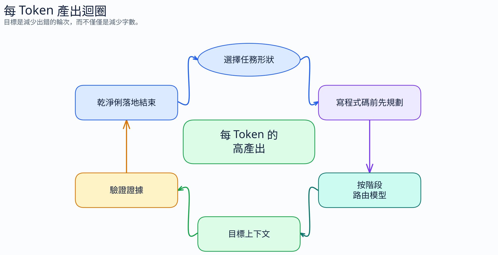

# 每個 Token 的產出 (Outcome per Token)

[← 返回指南](index.md)

---

Token 最佳化並非真正的目標。真正的目標是**在花費的每個 Token 中獲得更多被接受的工作**：已合併的 Pull Request、已關閉的 Bug、通過的測試、乾淨的審查，以及更少方向錯誤的 Agent 迴圈。

單純的 Token 最小化甚至可能是錯誤的決定。一個短暫的提示詞如果導致 Agent 猜測、修改錯誤的檔案、測試失敗並回退，其成本會比一個能讓首次實作就正確的較長計劃還要高昂。

## 為什麼每個 Token 的產出至關重要

雖然以用量計費的方式讓 Token 變得顯而易見，但工程團隊並非購買 Token。他們購買的是產出。

Tomasz Tunguz 將此描述為向「每美元智慧」的轉變：應用程式層競爭的是關閉一張 Tickect、交付一個 PR 或解決一個支援案件的成本，而不是最便宜的原始 Token。[^tunguz] 這直接對應到 Copilot 的工作。有用的指標是：

```text
每個 Token 的產出 = 已驗證的完成工作 / 花費的總 Token 數
```

對於 Agent 程式碼撰寫，其成本行為與簡單對話不同。Microsoft/Stanford 的論文 "How Do AI Agents Spend Your Money?" 指出，Agent 程式碼撰寫任務消耗的 Token 大約是程式碼對話的 **1,000 倍**，同一個任務的不同執行之間可能相差高達 **30 倍**，且更高的 Token 使用量並不能穩定提高準確度。[^agent-costs]

### 研究顯示的結果

| 發現 | 為什麼這很重要 |
|---|---|
| Agent 程式碼撰寫消耗 the Token 大約是程式碼對話的 **1,000 倍** | 不要將對話成本的直覺推導到 Agent 工作階段 |
| 同一個任務在不同執行之間可能相差高達 **30 倍** | 編列預算時保留彈性；單次執行並非穩定的成本估算 |
| 更高的 Token 使用量並不能穩定提高準確度 | 更多的探索並不自動等於更好的工作 |
| 準確度通常在中間成本時達到頂峰，然後趨於飽和 | 在每個步驟都預設使用最大的模型可能會浪費金錢 |
| 輸入 Token 主導了 Agent 的成本 | 上下文衛生與輸出簡潔度同等重要 |
| 模型低估了自身的 Token 使用量 | 不要信任 Agent 在任務前的成本猜測；使用預算和停止規則 |
| Token 效率因模型而異，且與通過率無關 | 應同時比較產出與成本，而非僅看基準測試分數 |

其含意很簡單：最佳化迴圈，而非句子。

## 每個 Token 產出的迴圈

高「每個 Token 的產出」來自於六個習慣：



1. 選擇正確的任務形式
2. 在實作前先計劃
3. 將正確的模型路由到正確的階段
4. 保持乾淨的上下文和快取邊界
5. 在宣稱完成前先進行驗證

低「每個 Token 的產出」通常具有相反的特徵：模糊的提示詞、龐大的上下文、高昂的模型被鎖定太久、沒有驗收條件、Agent 在計劃前就修改檔案、測試執行太晚，然後從頭開始重新工作。

## 作為超能力的提示詞技能

社群專案 [`obra/superpowers`](https://github.com/obra/superpowers) 推廣了一種有用的框架：將可重複的 Agent 實踐視為「技能」，而非一次性的提示詞。[^superpowers] 這不是 GitHub 的官方產品，但其技能類別非常符合 Copilot 的成本控制。

本章將此概念作為實用的分類法。

| 技能 | 作用 | Token 效果 |
|---|---|---|
| 腦力激盪 (Brainstorming) | 在選擇前探索多種方法 | 防止過早鎖定和方向錯誤的程式碼 |
| 計劃 (Planning) | 將意圖轉化為檔案層級的步驟與檢查 | 減少執行期間的猜測 |
| 保持綠燈 (Greenness) | 在工作過程中保持測試通過 | 避免偵錯未知的基準測試失敗 |
| 完成前驗證 (Verification before completion) | 在標記「完成」前需要證據 | 防止虛假完成與重做工作 |
| 完美結束 (Impeccable close) | 乾淨地結束，使條件、測試和 PR 摘要保持一致 | 防止審查耗損和後續的 Agent 工作階段 |
| 分支關閉紀律 (Branch-close discipline) | 在合併後乾淨地結束分支/工作階段 | 防止過期的上下文洩漏到下一個任務中 |

以下技能皆為模式。隨後介紹的公開函式庫是這些模式的範例實作，而非強制性相依套件。

## 值得借鑑的技能函式庫

當社群技能函式庫使下一個 Agent 行動更精確時，它們可以提高每個 Token 的產出：更清晰的需求、更安全的工作使用、更好的測試、更乾淨的接交或更強的最終審查。請將其視為可重複使用的實踐，而非 GitHub 或 Microsoft 的官方指引。大多數主張都是定性且基於經驗的；使用它們是因為它們編碼了良好的工作流程紀律，而不是因為它們證明了通用的基準測試收益。

| 函式庫 | 最適合借鑑的技能 | 使用時機 | 注意事項 |
|---|---|---|---|
| [`obra/superpowers`](https://github.com/obra/superpowers) | TDD、計劃、驗證、分支結束 | 需要廣泛的 Agent SDLC 紀律 | 社群框架 |
| [`softaworks/agent-toolkit`](https://github.com/softaworks/agent-toolkit) | 計劃協調、接交、熵減 | 複雜功能、長工作階段、龐大的說明檔案 | 個人工具包；定性主張 |
| [`catpilotai/catpilot-ai-guardrails`](https://github.com/catpilotai/catpilot-ai-guardrails) | 安全性與工具迴圈防護網 | Agent 涉及秘密、雲端、資料庫、Docker 或供應鏈 | 僅指引，非執行階段強制執行 |
| [`vercel-labs/agent-browser`](https://github.com/vercel-labs/agent-browser/blob/main/skills/agent-browser/SKILL.md) | 快照、等待與證據紀律 | Agent 測試瀏覽器 UI | 瀏覽器專用；已安裝的 CLI 內容具權威性 |
| [`vercel-labs/writing-guidelines`](https://github.com/vercel-labs/writing-guidelines) | 計畫即提示詞、輸出審查、AI 特徵偵測 | 文件、PR 說明、規格書、產生的散文 | 編輯指引，非具體的 Token 減少量 |
| [`mattpocock/skills`](https://github.com/mattpocock/skills) | TDD、Bug 診斷、程式碼審查、領域建模 | 工程任務需要更犀利的迴圈 | 範例偏向 Claude 和 TypeScript 工作流程 |
| [`PramodDutta/qaskills`](https://github.com/PramodDutta/qaskills) | QA 與測試生成技能 | 需要 Playwright、API、BDD、安全性、無障礙或 Bug 報告深度 | 龐大的技能檔案；早期專案 |

### 技能函式庫星標歷史 (Star History)

[](https://www.star-history.com/#obra/superpowers&softaworks/agent-toolkit&catpilotai/catpilot-ai-guardrails&vercel-labs/agent-browser&vercel-labs/writing-guidelines&mattpocock/skills&PramodDutta/qaskills&timeline)

星標歷史是採用率的訊號，而非品質的基準。請用它來了解社群的關注點，然後透過該函式庫是否改變了 Agent 的下一個行動來評估它。

### `obra/superpowers`：基準 Agent SDLC 紀律

使用 Superpowers 作為參考模式：技能是小型且具名的作業程序。其價值不在於品牌名稱，而在於將「小心謹慎」轉化為 Agent 可以遵循的具體動作。[^superpowers]

- 借鑑 TDD、計劃、驗證和分支結束的習慣。
- 將團隊規範轉化為小型、可重複使用的提示詞或技能檔案。
- 偏好強制要求提供證據的技能：測試輸出、檔案層級計劃、驗收條件或乾淨結束。
- 當單行指令即可引導下一個行動時，不要載入寬泛的技能。

### `softaworks/agent-toolkit`：計劃、接交與熵控制

`agent-toolkit` 是一個寬泛 of 個人工具包，包含適用於 Claude 風格 Agent 工作流程的技能、子 Agent 和命令。[^agent-toolkit] 它在這裡最合適的應用不是照抄所有內容，而是借鑑其長期執行工程工作的結構。

- 針對複雜功能使用 `gepetto` 風格的流程：研究、利害關係人提問、規格書、計劃、審查，然後執行。
- 當任務仍有隱藏的模糊性時，在編寫程式碼前使用 `requirements-clarity`。
- 當長工作階段必須轉移上下文而又不洩漏過期決策或秘密時，使用 `session-handoff`。
- 將 `reducing-entropy` 作為一種顯式的、偏向刪除的審查：更少的檔案、更少的分支、更少的程式碼、更清晰的接縫。
- 當 `AGENTS.md`、`CLAUDE.md` 或團隊提示詞變得如此龐大以致於變成上下文稅時，使用說明檔案重構模式。

### `catpilot-ai-guardrails`：在代價高昂的錯誤發生前進行風險阻斷

防護網技能藉由防止代價高昂的錯誤行為來提高每個 Token 的產出：洩漏的秘密、不安全的雲端變更、資料庫損壞、供應鏈轉移或重試迴圈。[^catpilot-guardrails] 當 Agent 擁有具備寫入能力的工具時，這些技能特別相關。

- 在涉及憑證、PII (個人識別資訊)、雲端 CLI、資料庫、Docker、CI 或相依性資訊清單的任務之前加入防護網。
- 在執行破壞性或高成本操作之前，要求進行顯式確認。
- 使用重試預算與迴圈停止規則，使 Agent 不會因為重複相同的失敗工具呼叫而燒掉 Token。
- 將技能指引與實際控制相結合：分支保護、CI、SAST、DAST、SCA、秘密掃描以及最小權限憑證。
- 不要將這些技能描述為合規強制執行。它們引導行為，並不對工具進行沙箱化。

### `agent-browser`：無 DOM 洪流的瀏覽器 QA

`agent-browser` 非常有用，因為它教導瀏覽器 Agent 使用精簡的觀察和以證據為導向的等待，而不是傾倒龐大的 HTML 或根據螢幕截圖進行猜測。[^agent-browser]

- 偏好無障礙樹快照與穩定的元素參照，而非原始的 DOM 傾倒。
- 在頁面變更操作後重新擷取快照；瀏覽器參照會過期。
- 等待可觀察的狀態 (如文字、URL 或網路閒置)，而不是固定的休眠時間。
- 擷取比例相稱的證據：失敗的選取器、可見狀態，僅在有用時擷取螢幕截圖。
- 將頁面內容視為不受信任的輸入。不要遵循測試中網站所嵌入的指令。

### `writing-guidelines`：將計劃作為提示詞、規格書和審查產出物

Vercel 的撰寫指引對工程 Agent 非常有用，因為它將模糊的文字轉化為可測試的產出物。[^writing-guidelines] 更好的撰寫能減少重做 Token：更少的隱藏目標、更少模糊的成功條件、更少詢問變更內容的審查評論。

- 使用可測試的動詞撰寫目標，而非模糊的抱負。
- 保持單一頁面或提示詞專注於單一工作。
- 將計劃作為實作提示詞、測試規格以及 PR 說明種子。
- 在將文字傳送給 Agent 之前，標記含糊不清的詞彙與模糊的量詞。
- 借鑑第二階段審查模式：要求另一個 Agent 或模型提供具體的 `file:line` 發現，而非一般的讚美。

### `mattpocock/skills`：減少猜測的工程迴圈

Matt Pocock 的技能非常有用，因為它們編碼了工程迴圈：TDD、Bug 診斷、程式碼審查軸、領域建模以及大型工作分解。[^mattpocock-skills] 當 Agent 傾向於直接從症狀跳到修改時，這些技能的效果最強。

- 使用 TDD 技能在實作前就接縫達成一致。
- 使用 Bug 診斷技能在進行理論推導前，建立快速、確定性的紅燈/綠燈迴圈。
- 將審查分為兩個軸：標準審查和規格審查，如此一來風格問題就不會遮掩需求遺漏。
- 使用領域建模詞彙 (如接縫、配接器、槓桿作用、局部性和模組深度) 來引導架構提示詞。
- 使用路標模式將需要人工參與的 Ticket 與 Agent 可執行的工作分開。

### `qaskills`：隨選 QA 深度

`qaskills` 是一個包含 CLI、MCP 伺服器、型錄、SDK 和驗證器的 QA 技能型錄。[^qaskills] 其 Token 價值在於專業化：當任務實際上偏重 QA 時，載入 QA 深度，而不是要求一個通用的 Agent 從頭開始發明測試策略。

- 針對頁面物件紀律、無障礙優先選取器、Fixture 以及反模式檢查使用 Playwright 技能。
- 針對風險矩陣、可追溯性、等價劃分以及進入/退出條件使用測試計劃技能。
- 當產出是具有嚴重性、優先級、環境和證據的可重現問題時，使用 Bug 報告技能。
- 當驗收條件應成為可執行的 Given/When/Then 情境時，使用 BDD/Cucumber 技能。
- 僅在這些檢查屬於任務的一部分時，才使用 OWASP、視覺迴歸、axe-core、k6 和 API 測試技能。

### 不要安裝每一項技能

技能也是上下文。僅安裝會改變 Agent 下一個行動的技能。

| 任務 | 載入 |
|---|---|
| 測試設計、QA 自動化、Bug 報告 | QA 技能 |
| 瀏覽器 UI 調查 | 瀏覽器快照/等待/證據技能 |
| 雲端、資料庫、Docker、秘密、相依性 | 防護網技能 |
| 規格書、文件、PR 說明 | 寫作與審查技能 |
| 長工作階段、複雜功能、接交 | 計劃與接交技能 |

如果一項技能不太可能改變下一個編輯、命令、測試或審查，請將其排除。最佳的技能選擇仍然是上下文選擇。

### 不要過度最佳化技能堆疊

技能研究本身可能會變成一個 Token 坑。追求完美的函式庫、完美的子 Agent 或「好中之好」的工作流程往往無法交付任何工作。實用的上限很快就會達到：對大多數任務而言，一個清晰的計劃加上一次艱難的挑戰通關就已經足夠強大。

在加入更多機制前，使用簡單的 `plan + grill-me` 迴圈：

1. 撰寫包含驗收條件、可能涉及的檔案、風險 and 驗證命令的計劃
2. 要求第二階段對計劃進行拷問 (grill)：遺漏的邊角案例、錯誤的假設、更便宜的途徑以及失敗模式
3. 修改一次，然後執行

### 腦力激盪技能

在需求模糊時，於第一次編輯前使用此技能。

```text
在編寫程式碼之前，列出三種實作方法。
針對每一種：可能修改的檔案、風險、測試策略以及 Token/成本風險。
請勿編輯檔案。
```

這花費了少量的推理 Token，以避免大得多的重做迴圈。

### 計劃技能

計劃將「建構 X」轉化為可執行的步驟。

當可用時，使用官方的 VS Code [Plan agent](https://code.visualstudio.com/docs/agents/planning)。它可以從 Agent 下拉選單中選擇，或使用 `/plan` 叫用，產生高階計劃以及實作與驗證步驟，並支援透過 `chat.planAgent.defaultModel` 和 `github.copilot.chat.implementAgent.model` 對計劃和實作進行個別的模型設定。[^plan-agent]

對於 GitHub.com 任務，Copilot 雲端 Agent 支援研究、計劃、反覆運算的流程：要求它研究儲存庫、在計劃上進行反覆運算，然後僅在準備就緒時實作協商一致的計劃。[^cloud-plan]

重要注意事項：

- VS Code Plan agent 的工作階段記憶體在對話結束時會被清除。在結束工作階段前，請在外部儲存重要的計劃。[^plan-agent]
- Copilot 雲端 Agent 在建立 PR 之前的計劃與反覆運算屬於 GitHub.com 的功能；Azure Boards、JIRA、Linear、Slack 或 Teams 等整合僅支援直接建立 PR。[^cloud-agent]
- 雲端 Agent 工作階段有 59 分鐘的硬性限制。請將大型工作拆分為較小的任務。[^cloud-agent]
- Business 和 Enterprise 使用者需要先啟用相關的系統管理員原則，才能使用雲端 Agent。[^cloud-agent]

### 保持綠燈技能

「保持綠燈」是本指南對一個簡單紀律的稱呼：保持測試基準為綠燈。

在要求 Agent 修改程式碼之前：

1. 瞭解測試目前是否通過
2. 告知 Agent 該基準
3. 要求它保留該基準
4. 在接受完成之前執行測試

如果測試一開始就是紅燈而 Agent 並不知情，它會花費 Token 去偵錯預先存在的失敗。如果測試在任務期間變成紅燈而 Agent 繼續編輯，則會加劇不確定性。

先確保綠燈基準。然後再變更。

### 完成前驗證技能

在沒有證據的情況下，不要接受「完成」。

```text
在您回報完成之前，執行針對性的測試或建構，
說明確切的命令，並確認每一項驗收條件。
```

這在最後會花費一點點成本。但當它防止虛假完成、審查耗損和第二次 Agent 工作階段時，能省下大量成本。

### 完美結束技能

「完美結束」是本指南對乾淨結束迴圈的稱呼。該術語非 Copilot 官方概念；其實踐才是重要的部分。

一個好的結束包括：

1. 檢查已接受的條件
2. 在相關之處執行測試/建構
3. 沒有意外的範疇蔓延
4. 沒有過期的 TODO 或被註解掉的嘗試
5. PR 摘要與實際的差異 (diff) 相符
6. 僅在真正需要時才指定下一步

這是每個 Token 的產出之紀律。草率的結束會將成本從實作轉移到審查、後續提示詞以及熱修復 (hotfix) 中。

### 分支關閉紀律

合併後，關閉分支和任何長期執行的 Agent 工作階段。不要在下一個無關的任務中繼續使用同一個上下文。

過期的工作階段會累積決策、工具輸出、檔案讀取和放棄的方法。隨後的每個提示詞都可能會將該歷史記錄作為輸入 Token 拖向前。乾淨的結束能避免下一個任務為前一個任務付費。

## 先計劃，然後廉價地執行

最強大的模式是兩個獨立的階段：


GitHub 的 [最佳化 AI 使用 (Optimize AI Usage)](https://docs.github.com/en/copilot/tutorials/optimize-ai-usage) 指引也指出了相同的觀點：預設使用功能最強的模型可能會增加 Token 使用量而無法改善產出，且在偏重執行的任務中過度使用推理模型可能會導致模型過度思考或引進不必要的變更，從而降低品質。[^optimize-ai] 同一個頁面給出了實用的規則：使用強大的推理模型進行計劃，然後使用更便宜的模型進行實作。

為什麼全新工作階段重要：

- 計劃對話不會在每次執行輪次中被重複傳送
- 執行上下文以乾淨的狀態開始
- 計劃成為穩定且對快取友善的前綴
- 模型路由是刻意為之，而非意外發生

這是 [先計劃，然後執行 §2.5.9](06-workflow-optimization.md#259-plan-first-then-execute-and-route-the-phases) 的擴展版本。

### 官方三層級框架

GitHub 的官方教學將工作分為三個模型通道。[^optimize-ai]

| 層級 | 最適合 | 每個 Token 的產出規則 |
|---|---|---|
| 推理模型 (Reasoning models) | 架構決策、複雜偵錯、系統設計、深度分析 | 用於計劃和艱難的裁決 |
| 中階模型 (Mid-tier models) | 需要高效實作的清晰計劃 | 在消除模糊性後用於執行 |
| 輕量模型 (Lighter models) | 重構、格式化、文件撰寫、常規的局部變更 | 用於有界限的機械性工作 |

在計劃中已經擷取了艱難的思考後，不要為前沿推理付費。

## 日常模型指南

模型建議變化迅速。請將此表視為路由指引，而非永久不變的真理。在發布客戶特定指引之前，請先檢查官方的[支援的模型](https://docs.github.com/en/copilot/reference/ai-models/supported-models)、[模型比較](https://docs.github.com/en/copilot/reference/ai-models/model-comparison)和[模型與定價](https://docs.github.com/en/copilot/reference/copilot-billing/models-and-pricing)頁面。[^supported-models][^models-pricing]

| 工作 | 良好預設 | 層級 | 典型輸入成本 / 1M Token | 原因 |
|---|---|---|---:|---|
| 快速查詢、語法、微小有界限的編輯 | Auto, GPT-5.6 Luna, MAI-Code-1-Flash, Claude Haiku 4.5 | 輕量級 | $0.75-$1.00 | 足夠快速且低成本，適合小型任務 |
| 清晰計劃後的正常實作 | Auto, GPT-5.6 Terra, MAI-Code-1-Flash, Claude Sonnet 5 | 通用型 / 輕量級 | $0.75-$2.50 | 平衡的執行，無需支付最高推理成本 |
| 具備中度不確定性的 Agent 程式碼撰寫 | GPT-5.6 Terra, GPT-5.4 nano, Claude Sonnet 5 | 通用型 / 輕量級 | $0.20-$2.50 | 當編輯需要工具但不需要前沿推理時的良好通道 |
| 艱難的架構、多檔案偵錯、長週期計劃 | GPT-5.6 Sol, GPT-5.5, Claude Opus 4.7/4.8, Claude Fable 5 | 強大 | $5.00-$10.00 | 在推理品質會改變產出之處支付溢價 |
| 開放權重 / 具備成本意識的程式碼撰寫 | Kimi K2.7 Code | 通用型 | $0.95 | 有用的選項，但需審查企業原則與安全性需求 |
| 視覺、多模態、偏重研究的工作 | Gemini 3.1 Pro (Public Preview), Claude Sonnet 5, GPT-5 mini 在支援之處 | 強大 / 通用型 | $0.25-$2.00 | 根據模態和研究協合度進行選擇，而非僅看原始基準測試排名 |
| 用於專注子任務的子 Agent | 較便宜/輕量的模型 | 輕量級 | 變動 | 子 Agent 不會繼承整個主對話，因此較便宜的模型通常已足夠 |

### 實用的預設值

對大多數團隊而言：

1. 針對未知的日常工作**優先使用 Auto**。GitHub 將 Auto 記錄為一個任務感知路由，並在使用於支援的介面時，為付費方案提供 10% 的 AI 額度折扣。[^auto]
2. 針對微小、有界限的工作使用 **Luna / MAI / Haiku**。
3. 針對正常的實作使用 **Terra / Sonnet / 中階**。
4. 針對計劃、架構 and 艱難的偵錯使用 **Sol / GPT-5.5 / Opus / Fable**。
5. **變更通道時使用全新的工作階段。** 在工作階段中途切換模型可能會使快取失效，並將累積的上下文拖入更昂貴的請求中。[^optimize-ai]

### 重要模型注意事項

- GPT-5.6 Sol 是強大的通道；不要將它固定用於日常編輯。
- Kimi K2.7 是 Copilot 中的開放權重模型，Business/Enterprise 可能需要管理員加入。請將其視為原則決策，而不僅僅是價格決策。[^kimi]
- MAI-Code-1-Flash 被記錄為持續改進的模型；其行為可能會隨著檢查點 (checkpoint) 的變更而演進。[^mai]
- Claude Sonnet 5 的促銷定價記錄截止至 2026 年 8 月 31 日。在發布定價指引前請於該日期後重新檢查。[^supported-models]
- Claude Fable 5 在 GitHub 文件中有資料保留注意事項：Anthropic 保留提示詞和輸出以運作安全性分類器。Business/Enterprise 管理員在啟用前應先審查條款。[^supported-models]
- FedRAMP 和歐盟 DR (資料落地) 的強制執行會增加 10% 的 AI 額度附加費，且可用模型可能會因區域和合規邊界而有所不同。[^fedramp-eu-dr]
- 舊版年度訂閱者在舊計費方式下可能無法獲得新模型和功能，如 GPT-5.6 系列、Claude Fable 5、Claude Sonnet 5 或 Kimi K2.7。[^models-pricing]
- 諸如 1M 上下文和可配置推理等擴展能力僅記錄於 VS Code 和 Copilot CLI 中。預設請使用一般上下文和一般推理。[^supported-models]
- 程式碼補全和下一個編輯建議在付費方案中不以 AI 額度計費。不要將每個 Copilot 介面視為相同的成本桶。[^usage-billing]

## 基準測試：有用，但非決定性

基準測試有助於選擇通道。但它們不能取代在您自身儲存庫上的測量。

| 基準測試 | 測量內容 | 為什麼這很重要 | 注意事項 |
|---|---|---|---|
| [SWE-bench Verified](https://www.swebench.com/verified.html) | 500 個經人工驗證的 Python GitHub 議題 (issue) | 經典的軟體工程代理指標 | 偏重 Python、靜態，存在潛在污染風險 |
| [SWE-bench Pro](https://labs.scale.com/leaderboard/swe_bench_pro_public) | 更困難的專業儲存庫任務 | 顯示企業級難度的懸崖 | 分數取決於架構與目前的即時排行榜 |
| [SWE-bench Live](https://swe-bench-live.github.io/) | 持續更新的議題 | 減少飽和與記憶 | 遞歸分數會隨時間轉變 |
| [DeepSWE](https://github.com/datacurve-ai/deep-swe) | 跨多種語言的 113 個原始長週期任務 | 良好的寫程式 Agent 和每項任務成本的視角 | 任務數量少；推理層級會變更結果 |
| [Terminal-Bench](https://www.tbench.ai/) | 終端機與 Shell 工作流程 | 對應到建構/測試/DevOps 的 Agent 工作 | 任務數量少；終端機技能不代表全部程式碼撰寫技能 |
| [Artificial Analysis](https://artificialanalysis.ai/methodology) | 智慧、定價、延遲、提供商比較 | 良好的成本/智慧散佈圖 | 綜合分數可能不符合僅寫程式的需求 |

### 分數快照

| 基準測試 | 模型 / 條件 | 分數 | 信心度 |
|---|---|---:|---|
| SWE-bench Verified | 在 SWE-bench Pro 論文時期的交叉引用中頂尖的模型 | >70% | 驗證自 Scale AI Pro 頁面 |
| SWE-bench Pro 公開 | GPT-5, 論文時期 | 23.3% | 經驗證 |
| SWE-bench Pro 公開 | Claude Opus 4.1, 論文時期 | 23.1% | 經驗證 |
| SWE-bench Pro 私有 | GPT-5, 論文時期 | 14.9% | 經驗證 |
| Terminal-Bench 2.0 | 前沿模型 | <65% | 驗證自基準測試摘要 |
| DeepSWE | GPT-5.6 Sol `[max]` | 72.7% | 方向性；取決於第三方鏡像與推理層級 |
| DeepSWE | 前三名差距 | <3.1 points | 方向性；取決於第三方鏡像與推理層級 |

使用帶有標籤的基準測試數據：

- **經驗證 (Verified)**：直接從主要排行榜或論文中讀取的來源。
- **方向性 (Directional)**：聚合器或次要來源。
- **軼事性 (Anecdotal)**：Reddit、Discord、社群媒體、單次工作階段報告。

引發本章討論的 Reddit 貼文適合作為假設產生器：它突顯了圍繞柏拉圖前沿 (Pareto frontiers)、DeepSWE 每項任務成本以及 GPT-5.6 層級路由的真實從業者模式。除非對照當前的 DeepSWE、Artificial Analysis 和官方 Copilot 定價進行重新檢查，否則不要將其確切的成本/任務階梯視為穩定的指南資料。

## 為什麼測試控制台 (Harness) 至關重要

模型的分數很少僅僅是模型分數。它包含：

- Agent 支架 (scaffold)
- 工具存取權限
- 檢索策略
- 推理付出 (reasoning effort)
- 快取定價假設
- 任務語言混合
- 基準測試版本
- 執行是一次嘗試還是多次嘗試

SWE-bench 本身指出，使用不同動作格式的版本不具直接可比性。DeepSWE 項目通常在模型名稱中包含推理層級，例如 `[max]`。Artificial Analysis 可能回答的是另一個問題：每美元的廣泛智慧，而非純粹的寫程式 Agent 通過率。[^swebench][^deepswe][^artificial-analysis]

使用基準測試來篩選候選對象。使用您自己儲存庫的任務來挑選預設值。

## 實用決策檢查清單

在開始昂貴的 Agent 工作階段之前：

1. **任務實際上是 Agent 化的嗎？** 如果不是，請使用 Ask 模式或內聯補全。
2. **基準測試是否呈綠燈？** 如果不是，請先修復或記錄它。
3. **計劃是否已撰寫？** 如果沒有，請先計劃。
4. **執行是否可以在更便宜的模型上執行？** 如果可以，請在全新的工作階段中進行。
5. **上下文是否已精確定位？** 僅附加計劃與相關檔案。
6. **驗收條件是否明確？** 如果不是，請在執行前撰寫。
7. **驗證是否已定義？** 提前指定測試/建構/檢查命令。
8. **模型切換是否會使快取失效？** 如果會，請改為全新開始。
9. **此組織/客戶是否允許此模型原則？** 檢查管理員 and 合規限制。
10. **結束是否乾淨？** 要求提供測試證據和簡潔摘要。

## 尚未納入的內容：Govify

"Govify" 這個名字似乎指涉多個無關的事物：地方政府 HR/招聘 SaaS、舊的 OpenGov Foundation PDF 轉換器以及該轉換器的雲端重寫版本。研究未發現其與 GitHub Copilot、Token 最佳化、AI 開發人員治理或每個 Token 產出的工作流程有任何經證實的關聯。

除非提供主要來源，否則請勿在本指南中將 Govify 用作案例研究。薄弱的提及只會帶來混亂，而非價值。

## 交叉參照

- [工作流程最佳化 §2.5.9](06-workflow-optimization.md#259-plan-first-then-execute-and-route-the-phases) — 先計劃習慣的簡短版本
- [上下文管理](04-context-management.md) — 快取與上下文衛生
- [輸出控制](05-output-control.md) — 輸出 Token 減少
- [實用設定](10-practical-setup.md) — 設定與操作習慣
- [模型選擇與定價](11-models-and-pricing.md) — 模型與定價介面
- [企業治理](12-enterprise-governance.md) — 預算、模型原則與管理員推廣

## 參考資料

[^agent-costs]: Longju Bai et al., ["How Do AI Agents Spend Your Money? Analyzing and Predicting Token Consumption in Agentic Coding Tasks"](https://arxiv.org/abs/2604.22750), arXiv:2604.22750.

[^tunguz]: Tomasz Tunguz, ["Intelligence Per Dollar"](https://tomtunguz.com/tokens-per-result).

[^superpowers]: [`obra/superpowers`](https://github.com/obra/superpowers)，社群 Agentic-skills 框架。

[^agent-toolkit]: [`softaworks/agent-toolkit`](https://github.com/softaworks/agent-toolkit)，社群 Agent 技能工具包。

[^catpilot-guardrails]: [`catpilotai/catpilot-ai-guardrails`](https://github.com/catpilotai/catpilot-ai-guardrails)，社群安全性防護網技能。

[^agent-browser]: [`vercel-labs/agent-browser` 瀏覽器 Agent 技能](https://github.com/vercel-labs/agent-browser/blob/main/skills/agent-browser/SKILL.md)。

[^writing-guidelines]: [`vercel-labs/writing-guidelines`](https://github.com/vercel-labs/writing-guidelines)，從業者撰寫與審查指引。

[^mattpocock-skills]: [`mattpocock/skills`](https://github.com/mattpocock/skills)，社群工程技能集合。

[^qaskills]: [`PramodDutta/qaskills`](https://github.com/PramodDutta/qaskills)，QA 技能型錄與工具。

[^plan-agent]: VS Code Docs, ["Planning with Copilot"](https://code.visualstudio.com/docs/agents/planning)。

[^cloud-plan]: GitHub Docs, ["Use Copilot agents: Research, plan, iterate"](https://docs.github.com/en/copilot/how-tos/copilot-on-github/use-copilot-agents/research-plan-iterate)。

[^cloud-agent]: GitHub Docs, ["About Copilot cloud agent"](https://docs.github.com/en/copilot/concepts/agents/cloud-agent/about-cloud-agent)。

[^optimize-ai]: GitHub Docs, ["Optimize AI Usage"](https://docs.github.com/en/copilot/tutorials/optimize-ai-usage)。

[^supported-models]: GitHub Docs, ["Supported AI models in Copilot"](https://docs.github.com/en/copilot/reference/ai-models/supported-models) and ["Model comparison"](https://docs.github.com/en/copilot/reference/ai-models/model-comparison)。

[^models-pricing]: GitHub Docs, ["Models and Pricing"](https://docs.github.com/en/copilot/reference/copilot-billing/models-and-pricing)。

[^auto]: GitHub Docs, ["Auto model selection"](https://docs.github.com/en/copilot/concepts/models/auto-model-selection)。

[^kimi]: GitHub Changelog, ["Kimi K2.7 now available for Copilot Business and Enterprise"](https://github.blog/changelog/2026-07-07-kimi-k2-7-now-available-for-copilot-business-and-enterprise/)。

[^mai]: GitHub Changelog, ["MAI-Code-1-Flash is now available for GitHub Copilot"](https://github.blog/changelog/2026-06-02-mai-code-1-flash-is-now-available-for-github-copilot/)。

[^fedramp-eu-dr]: GitHub Docs, ["FedRAMP models"](https://docs.github.com/en/copilot/concepts/models/fedramp-models) and ["GitHub Copilot with data residency"](https://docs.github.com/en/enterprise-cloud@latest/admin/data-residency/github-copilot-with-data-residency)。

[^usage-billing]: GitHub Docs, ["Usage-based billing for individuals"](https://docs.github.com/en/copilot/concepts/billing/usage-based-billing-for-individuals)。

[^swebench]: [SWE-bench Verified](https://www.swebench.com/verified.html)。

[^deepswe]: [DeepSWE](https://github.com/datacurve-ai/deep-swe)。

[^artificial-analysis]: [Artificial Analysis methodology](https://artificialanalysis.ai/methodology)。

---

**下一步：** [返回首頁 →](index.md)
